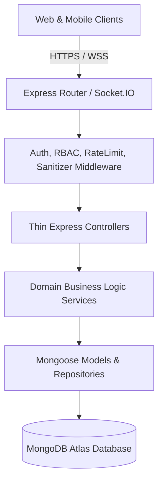
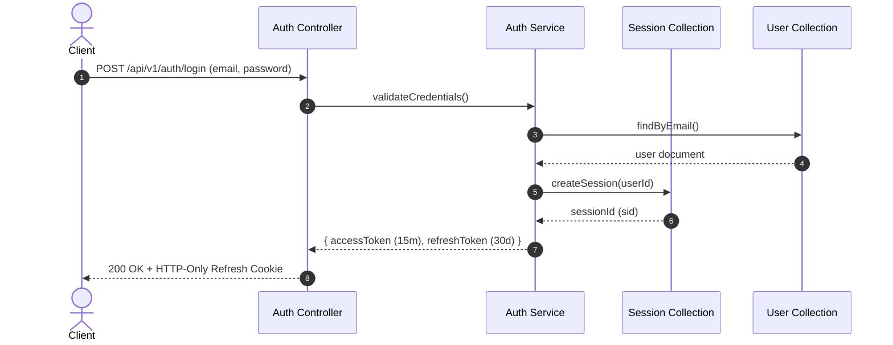
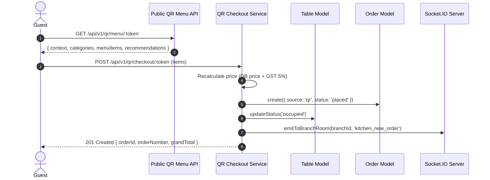
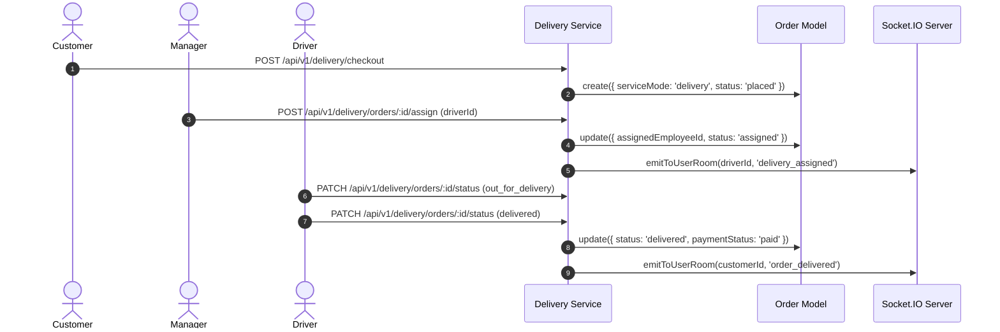
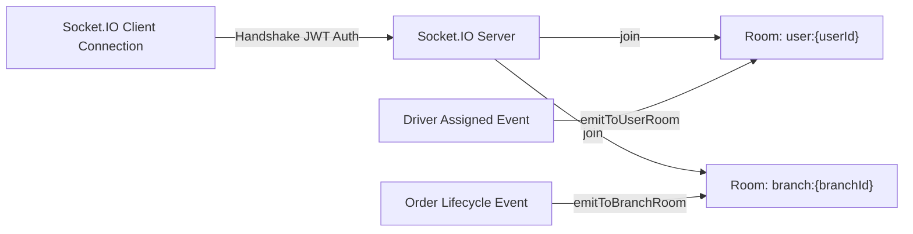

# DineX System Architecture Specification

This document presents the high-level software architecture, layered application flow, real-time messaging model, and deployment topology of the DineX Restaurant Management System.

---

## 1. High-Level Monorepo Architecture

DineX is structured as a monorepo enforcing a layered application flow:
`Routes → Middleware → Controllers → Services → Repositories → MongoDB`



---

## 2. Authentication & Session Teardown Flow



---

## 3. Dine-In QR Ordering Flow



---

## 4. Online Delivery Fulfillment Flow



---

## 5. Realtime Socket.IO Room Messaging Architecture



---

## 6. Analytics & Report Export Architecture

```mermaid
graph TD
    ClientReq[Analytics / Report Request] --> AuthCheck[requirePermission('reports.read')]
    AuthCheck --> Service[Analytics Service]
    Service --> Aggregation[Mongo Aggregation Pipeline & .lean()]
    Aggregation --> DTO[Summary DTO]
    DTO -->|Export Request| Generator[Report Export Generator]
    Generator -->|Sanitize Formulas| Formatter[CSV / XLSX / PDF Buffer]
    Formatter --> Response[Stream File Buffer]
```

---

## 7. Cloud Deployment Topology (Vercel + Render + Atlas)

```mermaid
graph TD
    UserBrowser[User Browser] -->|CDN / HTTPS| Vercel[Vercel Edge Network (Web SPA)]
    Vercel -->|REST API & WebSockets| Render[Render Container (Express API & Socket.IO)]
    Render -->|TLS 1.3 / IP Whitelisted| Atlas[(MongoDB Atlas Cluster)]
```
