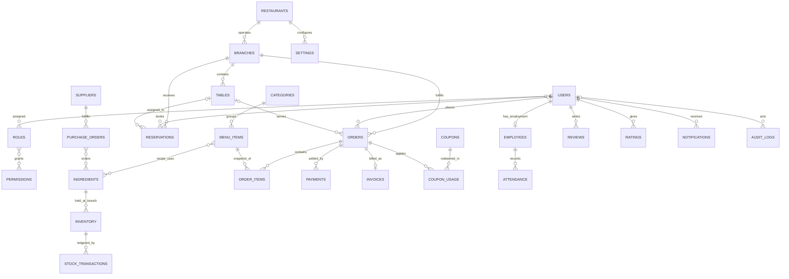

# Database Design Document (DDD)

| Field | Value |
| --- | --- |
| Project | X10Think Restaurant Management System |
| Database | MongoDB Atlas |
| ODM | Mongoose (implementation only; no model definitions in this document) |
| Version | 1.0 |
| Status | Database Architecture Baseline |
| Date | August 1, 2026 |
| Authority | This document is the required persistence blueprint for future backend development. |

## 1. Database Design Philosophy

MongoDB Atlas is appropriate because restaurant operations combine strongly related, fast-changing documents (an order and its price snapshot) with high-volume event records (payments, stock movements, audit events). Atlas provides managed replication, encryption, monitoring, backups, point-in-time recovery, and horizontal scaling while MongoDB's document model keeps operational reads close to the data they need.

The design uses **reference-first transactional data with purposeful denormalization**:

| Principle | Decision |
| --- | --- |
| Aggregate ownership | `orders`, `purchaseOrders`, and `reservations` are operational aggregates. Their bounded line items and status histories are embedded where a single workflow reads and writes them together. |
| Authoritative identity | Users, employees, menu items, ingredients, suppliers, branches, and permissions are separate collections and referenced by `ObjectId`. |
| Historical correctness | Order items, invoices, payments, coupon usage, and stock transactions retain immutable snapshots of display names, prices, tax, and relevant policy values. Later edits to menu or master data must not rewrite history. |
| Normalization | Use references for shared or unbounded entities, cross-domain relationships, and records with independent lifecycle or access rules. |
| Denormalization | Duplicate small read-optimized values only when they are bounded, have a declared source of truth, and can be updated transactionally or rebuilt. Examples: `branchName` snapshots on invoices and `currentStock` on inventory. |
| Embedding | Embed address snapshots, monetary breakdowns, preference objects, order line modifiers, status timelines, recipe components, and small role-permission assignments. Do not embed unbounded orders, payments, audit events, or notifications in a parent document. |
| Scalability | Every operational record is tenant- and branch-scoped. Indexes begin with `tenantId` where tenant isolation applies. Atlas replica sets are the baseline; shard only after measured growth, using stable high-cardinality compound keys. |
| Maintainability | Canonical enum values, audit fields, reference conventions, and index names are standardized in this document. Write paths must use transactions when changing multiple authoritative collections. |
| Performance | Query patterns drive indexes. List endpoints use seek pagination, projections, bounded arrays, and precomputed snapshots rather than unbounded document growth or broad collection scans. |

### 1.1 Scope Boundary

The required collection inventory is authoritative. Customer identity is represented by a `users` document with `userType: customer` and a `customerProfile` subdocument. Loyalty state is embedded in that bounded profile; future point-ledger scale may introduce a separately approved `loyaltyTransactions` collection. QR sessions and delivery details are embedded in the `orders` aggregate. Kitchen work state is stored on `orderItems` and `orders`, avoiding a duplicate source of truth.

## 2. Database Overview

| Domain | Collections |
| --- | --- |
| Identity and access | `users`, `roles`, `permissions`, `sessions`, `refreshTokens` |
| Organization | `restaurants`, `branches`, `settings`, `employees`, `attendance` |
| Service and menu | `tables`, `reservations`, `categories`, `menuItems`, `orders`, `orderItems` |
| Finance | `payments`, `invoices`, `coupons`, `couponUsage` |
| Inventory and procurement | `ingredients`, `inventory`, `stockTransactions`, `suppliers`, `purchaseOrders` |
| Engagement and governance | `reviews`, `ratings`, `notifications`, `auditLogs` |

All collections use BSON `ObjectId` as `_id`, UTC BSON `Date` values, ISO currency codes, and Atlas-managed encryption at rest. `tenantId` is required on every business and operational record, even during the initial single-restaurant release, to prevent a future SaaS migration from becoming a data rewrite.

## 3. Collection Design

### 3.1 Shared Document Contract

Unless an exception is noted, mutable collections contain these audit fields: `createdAt`, `updatedAt`, `createdBy`, `updatedBy`, `deletedAt`, `deletedBy`, and integer `version`. `createdBy` and `updatedBy` are nullable for system jobs. `deletedAt` and `deletedBy` are absent for active records. Financial, inventory, audit, and security records are append-only and never soft-deleted.

| Rule | Standard |
| --- | --- |
| References | Use `<entity>Id`, type `ObjectId`; never store a cross-collection reference only as text. |
| Money | Store values as BSON `Decimal128` in currency major units; persist `currency` as ISO 4217. Do not use floating-point values. |
| Status | Store canonical lowercase `snake_case` enum strings. |
| Contact data | Store normalized email in lowercase and phone in E.164 form, with display values only where needed. |
| Media | Store Cloudinary/public URL plus public ID and metadata; never store media blobs in these collections. |
| Tenant isolation | A service must always filter tenant-scoped reads and updates by `tenantId`; indexes reflect this predicate. |

### 3.2 Identity and Access Collections

#### `users`

| Aspect | Design |
| --- | --- |
| Purpose and identifier | Universal login/customer identity. `_id: ObjectId` is the user identifier. |
| Required fields | `tenantId`, `userType`, `status`, `profile.firstName`, `profile.lastName`, and at least one of `email` or `phone`. Staff accounts require `email`; password accounts require `passwordHash`. |
| Optional fields | `email`, `phone`, `passwordHash`, `avatar`, `lastLoginAt`, `failedLoginCount`, `lockedUntil`, `customerProfile`, `roleIds`, `branchIds`, `locale`, `timezone`, `consents`. |
| Embedded fields | `profile { firstName, lastName, displayName }`; `customerProfile { dateOfBirth, dietaryPreferences[], addresses[] (max 10), loyalty { points, tier, enrolledAt }, marketingPreferences }`. |
| Defaults and enums | `userType`: `customer`, `employee`, `supplier_contact`, `system_admin`; `status`: `pending`, `active`, `suspended`, `locked`, `deleted`; default `active` only after verified creation, zero failed attempts, locale `en-IN`. |
| Validation | Email/phone format and normalized form; password hash only, never plaintext; customer points are non-negative integer; addresses capped at 10. |
| Relationships | References `roles` through bounded `roleIds`; employee users have one `employees.userId`; customers own reservations, orders, reviews, ratings, and coupon usage. |
| Indexes and uniqueness | Unique partial `(tenantId, emailNormalized)` and `(tenantId, phoneE164)` for active non-null values; `(tenantId, status, userType)`; `(tenantId, roleIds)`; text/Atlas Search index on profile name, email, phone. |
| Lifecycle | Soft delete permitted for user profile after retention review; authentication is disabled immediately. Audit contract applies. |

#### `roles`

| Aspect | Design |
| --- | --- |
| Purpose and identifier | Tenant-scoped RBAC role; `_id: ObjectId`. |
| Required fields | `tenantId`, `name`, `code`, `status`, `permissionIds`. |
| Optional/defaults | `description`, `isSystem`; defaults: `status: active`, `isSystem: false`, empty permission array only for draft roles. |
| Validation and enums | `code` is lowercase snake case; `status`: `active`, `inactive`; system roles cannot be renamed or deleted. |
| Relationships | Many-to-many with `permissions`; assigned to `users` and employees through users. |
| Indexes/constraints | Unique `(tenantId, code)` and `(tenantId, name)` with active/deleted filter; `(tenantId, status)`. |
| Lifecycle | Soft delete only when unassigned; audit contract applies. |

#### `permissions`

| Aspect | Design |
| --- | --- |
| Purpose and identifier | Immutable capability catalog; `_id: ObjectId`. |
| Required fields | `code`, `module`, `action`, `scope`, `status`. |
| Optional/defaults | `description`, `isSystem`; default `status: active`, `isSystem: true`. |
| Validation and enums | `code` format `module.action`; `scope`: `own`, `branch`, `restaurant`, `tenant`, `platform`; `status`: `active`, `inactive`. |
| Relationships | Referenced by `roles.permissionIds`; no direct user permission mutation in baseline. |
| Indexes/constraints | Globally unique `code`; `(module, action)`. |
| Lifecycle | No soft delete for shipped permissions; deactivate only. Audit fields apply. |

#### `sessions`

| Aspect | Design |
| --- | --- |
| Purpose and identifier | Server-side session/device state; `_id: ObjectId`. |
| Required fields | `tenantId`, `userId`, `sessionId`, `status`, `issuedAt`, `expiresAt`, `ipHash`, `userAgentHash`. |
| Optional/defaults | `lastSeenAt`, `revokedAt`, `revokedBy`, `branchId`, `metadata`; default `status: active`. |
| Validation and enums | `status`: `active`, `revoked`, `expired`; `expiresAt` must follow `issuedAt`. Raw IP and user agent are not retained unless policy explicitly permits it. |
| Relationships | Many sessions to one user; one session has one or more refresh token rotations. |
| Indexes/constraints | Unique `sessionId`; `(tenantId, userId, status, expiresAt)`; TTL on `expiresAt`. |
| Lifecycle | TTL deletion after expiry; no soft delete. Audit fields limited to issued/revoked actor and timestamps. |

#### `refreshTokens`

| Aspect | Design |
| --- | --- |
| Purpose and identifier | Hashed, rotating refresh-token records; `_id: ObjectId`. |
| Required fields | `tenantId`, `userId`, `sessionId`, `tokenHash`, `issuedAt`, `expiresAt`, `status`. |
| Optional/defaults | `replacedByTokenId`, `revokedAt`, `revocationReason`; default `status: active`. |
| Validation and enums | Store a salted hash only; `status`: `active`, `rotated`, `revoked`, `expired`; an active session has at most one active token. |
| Relationships | References `users` and `sessions`; self-reference on rotation. |
| Indexes/constraints | Unique `tokenHash`; `(sessionId, status)`; TTL on `expiresAt`. |
| Lifecycle | TTL delete after expiry; append-only status changes; no soft delete. |

### 3.3 Organization and Workforce Collections

#### `restaurants`

| Aspect | Design |
| --- | --- |
| Purpose and identifier | Restaurant brand and tenancy root; `_id: ObjectId` also defines the initial `tenantId`. |
| Required fields | `name`, `legalName`, `status`, `currency`, `timezone`, `contact.email`, `address`. |
| Optional/defaults | `taxRegistration`, `logo`, `serviceModes`, `businessHours`, `policies`; defaults: `status: active`, `serviceModes: [dine_in, takeaway]`. |
| Validation/enums | `status`: `draft`, `active`, `suspended`, `closed`; currency ISO 4217; valid IANA timezone; opening ranges cannot overlap per weekday. |
| Relationships | One restaurant/tenant has many branches, settings, users, and all tenant records. |
| Indexes/constraints | Unique normalized `legalName` plus country tax identifier where provided; `(status)`. |
| Lifecycle | Soft delete prohibited after go-live; use `closed` status. Audit contract applies. |

#### `branches`

| Aspect | Design |
| --- | --- |
| Purpose and identifier | Operational location; `_id: ObjectId`. |
| Required fields | `tenantId`, `restaurantId`, `name`, `code`, `status`, `address`, `timezone`, `serviceModes`. |
| Optional/defaults | `phone`, `email`, `managerEmployeeId`, `businessHours`, `taxProfile`, `coordinates`, `kitchenStations`; default `status: active`. |
| Validation/enums | `code` uppercase-safe identifier; `status`: `active`, `inactive`, `temporarily_closed`; coordinates valid longitude/latitude; manager must be an active employee in this branch. |
| Relationships | References restaurant and optional manager; parent for tables, reservations, inventory, orders, and attendance. |
| Indexes/constraints | Unique `(tenantId, code)` and `(tenantId, name)`; `2dsphere` on `coordinates`; `(tenantId, status)`. |
| Lifecycle | Soft delete only before operational use; otherwise deactivate. Audit contract applies. |

#### `settings`

| Aspect | Design |
| --- | --- |
| Purpose and identifier | Versioned configuration by tenant or branch; `_id: ObjectId`. |
| Required fields | `tenantId`, `scope`, `key`, `value`, `valueType`, `status`. |
| Optional/defaults | `branchId`, `description`, `effectiveFrom`, `effectiveTo`; default `status: active`. |
| Validation/enums | `scope`: `tenant`, `branch`; branch scope requires `branchId`; `valueType`: `string`, `number`, `boolean`, `json`, `secret_reference`; keys use dotted lowercase names. |
| Relationships | References branch when scoped; settings drive policies but should not contain secrets, only secret-manager references. |
| Indexes/constraints | Unique `(tenantId, scope, branchId, key)` for active record; `(tenantId, key, status)`. |
| Lifecycle | Soft delete/restore supported; historical versions remain auditable. |

#### `employees`

| Aspect | Design |
| --- | --- |
| Purpose and identifier | Employment record separated from login identity; `_id: ObjectId`. |
| Required fields | `tenantId`, `userId`, `employeeNumber`, `employmentStatus`, `joinedAt`, `primaryBranchId`. |
| Optional/defaults | `department`, `jobTitle`, `branchIds`, `managerEmployeeId`, `employmentType`, `emergencyContact`, `terminatedAt`; default `employmentStatus: active`. |
| Validation/enums | `employmentStatus`: `active`, `on_leave`, `suspended`, `terminated`; `employmentType`: `full_time`, `part_time`, `contract`, `temporary`; primary branch must occur in `branchIds`. |
| Relationships | One-to-one with employee `users` record; references branches and optional manager; parent for attendance and staff-created orders. |
| Indexes/constraints | Unique `(tenantId, employeeNumber)` and unique active `userId`; `(tenantId, primaryBranchId, employmentStatus)`. |
| Lifecycle | Never hard-delete payroll-relevant identity; terminate and soft-delete only after legal retention. Audit contract applies. |

#### `attendance`

| Aspect | Design |
| --- | --- |
| Purpose and identifier | Immutable shift attendance record; `_id: ObjectId`. |
| Required fields | `tenantId`, `employeeId`, `branchId`, `workDate`, `status`. |
| Optional/defaults | `scheduledStartAt`, `scheduledEndAt`, `clockInAt`, `clockOutAt`, `breakMinutes`, `notes`, `approvedBy`; default `status: scheduled`. |
| Validation/enums | `status`: `scheduled`, `present`, `late`, `absent`, `on_leave`, `completed`; timestamps must be chronological; break minutes non-negative. |
| Relationships | References employee, branch, and approver user. |
| Indexes/constraints | Unique `(tenantId, employeeId, workDate)`; `(tenantId, branchId, workDate, status)`. |
| Lifecycle | Correct using approval-aware updates; no soft or hard delete after payroll export. Audit contract applies. |

### 3.4 Service, Menu, and Order Collections

#### `tables`

| Aspect | Design |
| --- | --- |
| Purpose and identifier | Dine-in seating resource; `_id: ObjectId`. |
| Required fields | `tenantId`, `branchId`, `tableNumber`, `capacity`, `status`. |
| Optional/defaults | `name`, `zone`, `shape`, `qrTokenHash`, `currentOrderId`, `assignedEmployeeId`, `notes`; defaults: `status: available`, `isActive: true`. |
| Validation/enums | Capacity integer 1-50; `status`: `available`, `reserved`, `occupied`, `dirty`, `out_of_service`; QR token stored hashed and rotatable. |
| Relationships | References branch, optional current order and employee; assigned by reservations. |
| Indexes/constraints | Unique `(tenantId, branchId, tableNumber)`; `(tenantId, branchId, status)`; unique sparse `qrTokenHash`. |
| Lifecycle | Soft delete only when no active reservation/order; otherwise set inactive/out_of_service. Audit contract applies. |

#### `reservations`

| Aspect | Design |
| --- | --- |
| Purpose and identifier | Time-bounded dining commitment; `_id: ObjectId`. |
| Required fields | `tenantId`, `branchId`, `customerId`, `partySize`, `startAt`, `endAt`, `status`, `source`. |
| Optional/defaults | `tableId`, `guestName`, `guestPhone`, `specialRequests`, `confirmationCode`, `assignedBy`, `cancelReason`; default `status: pending`. |
| Validation/enums | Party size 1-50; `endAt > startAt`; `status`: `pending`, `confirmed`, `seated`, `completed`, `cancelled`, `no_show`, `waitlisted`; `source`: `web`, `phone`, `walk_in`, `staff`, `partner`. |
| Relationships | References customer user, branch, optional table and staff actors; can result in an order. |
| Indexes/constraints | Unique `(tenantId, confirmationCode)`; `(tenantId, branchId, startAt, status)`; `(tenantId, tableId, startAt, endAt, status)`; `(tenantId, customerId, startAt)`. |
| Lifecycle | Never delete confirmed historical booking; use status transitions. Audit contract applies. |

#### `categories`

| Aspect | Design |
| --- | --- |
| Purpose and identifier | Branch/tenant menu grouping; `_id: ObjectId`. |
| Required fields | `tenantId`, `name`, `slug`, `status`, `displayOrder`. |
| Optional/defaults | `parentCategoryId`, `branchIds`, `description`, `image`, `availableChannels`; defaults: `status: active`, all enabled channels. |
| Validation/enums | Slug lowercase URL-safe; `status`: `active`, `inactive`; only one nesting level in baseline. |
| Relationships | Self-reference for optional parent; referenced by menu items. |
| Indexes/constraints | Unique `(tenantId, slug)`; `(tenantId, status, displayOrder)`; `(tenantId, parentCategoryId)`. |
| Lifecycle | Soft delete only when no active menu item references it; audit contract applies. |

#### `menuItems`

| Aspect | Design |
| --- | --- |
| Purpose and identifier | Sellable menu definition; `_id: ObjectId`. |
| Required fields | `tenantId`, `categoryId`, `name`, `slug`, `basePrice`, `currency`, `status`, `availableChannels`. |
| Optional/defaults | `branchAvailability`, `description`, `images`, `dietaryTags`, `allergens`, `modifierGroups`, `recipe`, `preparationMinutes`, `taxCategory`, `sku`; defaults: `status: active`, `isAvailable: true`. |
| Validation/enums | Price non-negative Decimal128; `status`: `draft`, `active`, `inactive`, `archived`; channels: `dine_in`, `takeaway`, `delivery`, `qr`; modifier group/item counts bounded; recipe components `{ ingredientId, quantity, unit }` must be positive. |
| Relationships | References category and ingredients inside bounded recipe; historical sales use `orderItems` snapshots, never this document's current price. |
| Indexes/constraints | Unique `(tenantId, slug)`; sparse unique `(tenantId, sku)`; `(tenantId, categoryId, status, isAvailable)`; Atlas Search on name, description, tags; `(tenantId, branchAvailability.branchId, status)`. |
| Lifecycle | Soft delete/archive only when unavailable; preserve order history. Audit contract applies. |

#### `orders`

| Aspect | Design |
| --- | --- |
| Purpose and identifier | Core order aggregate and operational lifecycle; `_id: ObjectId`. |
| Required fields | `tenantId`, `branchId`, `orderNumber`, `orderType`, `status`, `currency`, `itemsSubtotal`, `taxTotal`, `grandTotal`, `placedAt`. |
| Optional/defaults | `customerId`, `tableId`, `reservationId`, `createdByEmployeeId`, `couponUsageId`, `delivery`, `qrContext`, `notes`, `discountTotal`, `serviceChargeTotal`, `paymentStatus`, `kitchenStatus`, `statusHistory`; defaults: zero monetary adjustments, `paymentStatus: unpaid`, `kitchenStatus: not_sent`. |
| Validation/enums | `orderType`: `dine_in`, `takeaway`, `delivery`, `qr`; `status`: `draft`, `placed`, `confirmed`, `in_preparation`, `ready`, `served`, `completed`, `cancelled`, `voided`; totals cannot be negative and equal persisted line/tax/discount calculation; dine-in requires table or explicit walk-in context; delivery requires address snapshot. |
| Relationships | References branch, optional customer/table/reservation/employee/coupon usage. One order has many `orderItems`, payments, and normally one invoice. Embedded `delivery` contains a bounded address snapshot and milestones. |
| Indexes/constraints | Unique `(tenantId, branchId, orderNumber)`; `(tenantId, branchId, status, placedAt desc)`; `(tenantId, branchId, kitchenStatus, placedAt)`; `(tenantId, customerId, placedAt desc)`; `(tenantId, tableId, status)`; `(tenantId, paymentStatus, placedAt)`; `(tenantId, orderType, placedAt)`. |
| Lifecycle | Financially or inventory-affecting orders are not deleted; cancel/void with reason and actor. Audit contract plus immutable `statusHistory` apply. |

#### `orderItems`

| Aspect | Design |
| --- | --- |
| Purpose and identifier | Independently addressable order line and kitchen work unit; `_id: ObjectId`. |
| Required fields | `tenantId`, `orderId`, `branchId`, `lineNumber`, `menuItemId`, `nameSnapshot`, `unitPrice`, `quantity`, `lineSubtotal`, `status`. |
| Optional/defaults | `modifierSnapshot`, `notes`, `taxSnapshot`, `discountSnapshot`, `recipeSnapshot`, `kitchenStation`, `preparedByEmployeeId`, `startedAt`, `readyAt`, `servedAt`; defaults `status: pending`, zero discount/tax. |
| Validation/enums | Quantity positive decimal to configured precision; line calculation must match snapshot values; `status`: `pending`, `sent`, `in_preparation`, `ready`, `served`, `cancelled`, `voided`; only allowed state transitions. |
| Relationships | References order, menu item, branch, optional chef. The recipe snapshot is the authoritative inventory-deduction basis for that sale. |
| Indexes/constraints | Unique `(orderId, lineNumber)`; `(tenantId, branchId, status, kitchenStation, createdAt)`; `(tenantId, menuItemId, createdAt)`. |
| Lifecycle | Never delete after order placement; cancel/void with reason. Audit fields apply. |

### 3.5 Finance Collections

#### `payments`

| Aspect | Design |
| --- | --- |
| Purpose and identifier | Payment attempt, settlement, refund, and reconciliation record; `_id: ObjectId`. |
| Required fields | `tenantId`, `branchId`, `orderId`, `amount`, `currency`, `method`, `status`, `idempotencyKey`, `initiatedAt`. |
| Optional/defaults | `gateway`, `gatewayTransactionRef`, `providerPayloadRef`, `receivedByEmployeeId`, `tipAmount`, `refundOfPaymentId`, `failureCode`, `settledAt`; default `tipAmount: 0`. |
| Validation/enums | Amount positive except an explicit refund record; `method`: `cash`, `card`, `upi`, `wallet`, `bank_transfer`, `online`, `gift_card`; `status`: `initiated`, `authorized`, `captured`, `failed`, `cancelled`, `partially_refunded`, `refunded`, `reversed`; payment token/reference only, never PAN/CVV. |
| Relationships | References order, branch, cashier, optional original payment. Multiple payments allow split settlement. |
| Indexes/constraints | Unique `(tenantId, idempotencyKey)`; sparse unique `(gateway, gatewayTransactionRef)`; `(tenantId, orderId, status)`; `(tenantId, branchId, status, initiatedAt desc)`; `(tenantId, settledAt desc)`. |
| Lifecycle | Append-only financial evidence; no soft/hard delete. Audit fields include refund actors. |

#### `invoices`

| Aspect | Design |
| --- | --- |
| Purpose and identifier | Final tax/billing artifact; `_id: ObjectId`. |
| Required fields | `tenantId`, `branchId`, `orderId`, `invoiceNumber`, `issuedAt`, `currency`, `subtotal`, `taxTotal`, `discountTotal`, `grandTotal`, `status`. |
| Optional/defaults | `customerSnapshot`, `branchSnapshot`, `paymentSummary`, `pdfUrl`, `voidReason`, `voidedAt`; default `status: issued`. |
| Validation/enums | Invoice totals equal immutable order billing snapshot; `status`: `issued`, `voided`, `credited`; invoice number is never reused. |
| Relationships | One logical invoice per finalized order, references order and optional customer snapshot. |
| Indexes/constraints | Unique `(tenantId, invoiceNumber)` and unique active `(tenantId, orderId)`; `(tenantId, branchId, issuedAt desc)`. |
| Lifecycle | Never delete; void/credit through compensating document/process. Audit fields apply. |

#### `coupons`

| Aspect | Design |
| --- | --- |
| Purpose and identifier | Promotional rule definition; `_id: ObjectId`. |
| Required fields | `tenantId`, `code`, `discountType`, `value`, `startsAt`, `endsAt`, `status`. |
| Optional/defaults | `branchIds`, `orderTypes`, `minimumOrderAmount`, `maximumDiscountAmount`, `usageLimit`, `perCustomerLimit`, `eligibleCustomerIds`, `eligibleMenuItemIds`, `stackable`; defaults: `status: draft`, `stackable: false`. |
| Validation/enums | Normalized uppercase code; `discountType`: `percentage`, `fixed_amount`; percentage 0-100; fixed value positive; starts before ends; limits non-negative integers. |
| Relationships | Referenced by coupon usage and orders through the usage record. |
| Indexes/constraints | Unique `(tenantId, code)`; `(tenantId, status, startsAt, endsAt)`; `(tenantId, branchIds, status)`. |
| Lifecycle | Soft delete only while unused; expired/disabled coupons are retained. Audit contract applies. |

#### `couponUsage`

| Aspect | Design |
| --- | --- |
| Purpose and identifier | Immutable redemption evidence; `_id: ObjectId`. |
| Required fields | `tenantId`, `couponId`, `orderId`, `customerId`, `codeSnapshot`, `discountAmount`, `usedAt`, `status`. |
| Optional/defaults | `branchId`, `reversedAt`, `reversalReason`; default `status: applied`. |
| Validation/enums | Discount non-negative and not above order eligible amount; `status`: `applied`, `reversed`, `voided`. |
| Relationships | References coupon, order, customer, and branch. |
| Indexes/constraints | Unique `(tenantId, orderId, couponId)`; `(tenantId, couponId, usedAt)`; `(tenantId, couponId, customerId, status)`. |
| Lifecycle | No delete; reversal preserves original use. Audit fields apply. |

### 3.6 Inventory and Procurement Collections

#### `ingredients`

| Aspect | Design |
| --- | --- |
| Purpose and identifier | Canonical stock-tracked consumable; `_id: ObjectId`. |
| Required fields | `tenantId`, `name`, `sku`, `baseUnit`, `status`. |
| Optional/defaults | `description`, `category`, `preferredSupplierId`, `reorderUnit`, `allergenInfo`, `yieldFactor`; defaults `status: active`, `yieldFactor: 1`. |
| Validation/enums | Base unit: `g`, `kg`, `ml`, `l`, `unit`, `pack`; yield factor positive; `status`: `active`, `inactive`, `archived`. |
| Relationships | Referenced by menu recipes, inventory, PO line items, and stock transactions. |
| Indexes/constraints | Unique `(tenantId, sku)`; unique normalized `(tenantId, name, baseUnit)`; `(tenantId, preferredSupplierId, status)`. |
| Lifecycle | Archive when unused; preserve traceability. Audit contract applies. |

#### `inventory`

| Aspect | Design |
| --- | --- |
| Purpose and identifier | Current branch stock balance and threshold state; `_id: ObjectId`. |
| Required fields | `tenantId`, `branchId`, `ingredientId`, `currentQuantity`, `reservedQuantity`, `reorderLevel`, `unit`, `status`. |
| Optional/defaults | `averageUnitCost`, `lastCountedAt`, `lastTransactionAt`, `storageLocation`, `expirySummary`; defaults: zero reserved quantity, `status: active`. |
| Validation/enums | Quantities are Decimal128 and non-negative; `reservedQuantity <= currentQuantity`; unit matches ingredient base unit or approved conversion; `status`: `active`, `out_of_stock`, `inactive`. |
| Relationships | One inventory balance per branch/ingredient; stock transactions are its immutable ledger. |
| Indexes/constraints | Unique `(tenantId, branchId, ingredientId)`; `(tenantId, branchId, status, currentQuantity)`; `(tenantId, branchId, reorderLevel)`. |
| Lifecycle | Soft delete only with zero balance and no active menu use; audit contract applies. |

#### `stockTransactions`

| Aspect | Design |
| --- | --- |
| Purpose and identifier | Immutable inventory ledger movement; `_id: ObjectId`. |
| Required fields | `tenantId`, `branchId`, `ingredientId`, `transactionType`, `quantityDelta`, `unit`, `occurredAt`, `balanceAfter`, `sourceType`, `sourceId`. |
| Optional/defaults | `unitCost`, `reason`, `purchaseOrderId`, `orderId`, `orderItemId`, `performedBy`, `metadata`; default `sourceType: manual_adjustment` only for authorized adjustment. |
| Validation/enums | `transactionType`: `purchase_receipt`, `order_consumption`, `waste`, `adjustment_in`, `adjustment_out`, `return_to_supplier`, `transfer_in`, `transfer_out`, `stock_count`; sign must match type; balance after cannot be negative. |
| Relationships | References ingredient, branch, inventory logical balance, optional PO/order/order line, and actor. |
| Indexes/constraints | Unique `(tenantId, sourceType, sourceId, ingredientId, transactionType)` for idempotent sources; `(tenantId, branchId, ingredientId, occurredAt desc)`; `(tenantId, transactionType, occurredAt desc)`; `(tenantId, orderId)`. |
| Lifecycle | Append-only; correction via compensating transaction only. No soft/hard delete. |

#### `suppliers`

| Aspect | Design |
| --- | --- |
| Purpose and identifier | Vendor master record; `_id: ObjectId`. |
| Required fields | `tenantId`, `name`, `status`, `contacts`. |
| Optional/defaults | `supplierCode`, `taxRegistration`, `address`, `paymentTermsDays`, `ingredientIds`, `rating`, `notes`; default `status: active`, payment terms 0. |
| Validation/enums | At least one contact with valid phone/email; `status`: `active`, `inactive`, `blocked`; rating 1-5 when present. |
| Relationships | Referenced by ingredients and purchase orders; has many POs. |
| Indexes/constraints | Unique sparse `(tenantId, supplierCode)`; unique `(tenantId, taxRegistration)` when present; text/Atlas Search on name/contact; `(tenantId, status)`. |
| Lifecycle | Soft delete only if no open PO; otherwise deactivate/block. Audit contract applies. |

#### `purchaseOrders`

| Aspect | Design |
| --- | --- |
| Purpose and identifier | Procurement aggregate including bounded PO lines and receipts; `_id: ObjectId`. |
| Required fields | `tenantId`, `branchId`, `supplierId`, `poNumber`, `status`, `currency`, `items`, `createdByEmployeeId`, `orderedAt`. |
| Optional/defaults | `approvedBy`, `approvedAt`, `expectedDeliveryAt`, `receivedAt`, `notes`, `taxTotal`, `discountTotal`, `grandTotal`; defaults: zero adjustments, `status: draft`. |
| Embedded fields | `items[]` (bounded by configured max) contains `{ ingredientId, ingredientSnapshot, orderedQuantity, receivedQuantity, unit, unitCost, taxRate, lineTotal }`; `receiptHistory[]` is bounded and references generated stock transactions. |
| Validation/enums | `status`: `draft`, `pending_approval`, `approved`, `sent`, `partially_received`, `received`, `cancelled`, `closed`; item quantities positive, received never above ordered without authorized over-receipt, totals calculated from lines. |
| Relationships | References supplier, branch, employees, ingredients; receiving creates inventory updates and stock transactions. |
| Indexes/constraints | Unique `(tenantId, branchId, poNumber)`; `(tenantId, branchId, status, expectedDeliveryAt)`; `(tenantId, supplierId, status, orderedAt desc)`. |
| Lifecycle | No delete after approval; cancel/close with actor/reason. Audit contract applies. |

### 3.7 Engagement and Governance Collections

#### `reviews`

| Aspect | Design |
| --- | --- |
| Purpose and identifier | Moderated qualitative feedback; `_id: ObjectId`. |
| Required fields | `tenantId`, `branchId`, `customerId`, `orderId`, `content`, `status`, `submittedAt`. |
| Optional/defaults | `title`, `response`, `respondedBy`, `respondedAt`, `moderationReason`; default `status: pending`. |
| Validation/enums | Content trimmed, 10-2,000 characters; `status`: `pending`, `published`, `hidden`, `rejected`; one review per customer/order. |
| Relationships | References customer, order, branch, optional responder; related rating may share order but stays separate. |
| Indexes/constraints | Unique `(tenantId, customerId, orderId)`; `(tenantId, branchId, status, submittedAt desc)`; Atlas Search for published content. |
| Lifecycle | Soft delete only if policy requires removal; preserve moderation audit. |

#### `ratings`

| Aspect | Design |
| --- | --- |
| Purpose and identifier | Structured experience scoring; `_id: ObjectId`. |
| Required fields | `tenantId`, `branchId`, `customerId`, `orderId`, `overallScore`, `submittedAt`, `status`. |
| Optional/defaults | `dimensions { food, service, ambience, delivery }`, `reviewId`; default `status: active`. |
| Validation/enums | Each supplied score integer 1-5; one rating per customer/order; `status`: `active`, `hidden`, `withdrawn`. |
| Relationships | References customer, order, branch, optional review. |
| Indexes/constraints | Unique `(tenantId, customerId, orderId)`; `(tenantId, branchId, status, submittedAt desc)`; `(tenantId, branchId, overallScore)`. |
| Lifecycle | Withdraw rather than delete; audit contract applies. |

#### `notifications`

| Aspect | Design |
| --- | --- |
| Purpose and identifier | Per-recipient delivery record for operational/customer communication; `_id: ObjectId`. |
| Required fields | `tenantId`, `recipientUserId`, `type`, `channel`, `title`, `status`, `createdAt`. |
| Optional/defaults | `branchId`, `body`, `data`, `sourceType`, `sourceId`, `priority`, `readAt`, `sentAt`, `failedAt`, `expiresAt`; defaults `status: queued`, `priority: normal`. |
| Validation/enums | `channel`: `in_app`, `email`, `sms`, `push`; `status`: `queued`, `sent`, `delivered`, `read`, `failed`, `cancelled`; `priority`: `low`, `normal`, `high`, `critical`; payload contains no secrets/payment details. |
| Relationships | References recipient user, optional branch and source aggregate. |
| Indexes/constraints | `(tenantId, recipientUserId, status, createdAt desc)`; `(tenantId, branchId, type, createdAt desc)`; TTL on `expiresAt`; `(tenantId, sourceType, sourceId)`. |
| Lifecycle | TTL removal after policy window; read state retained until expiry. No soft delete. |

#### `auditLogs`

| Aspect | Design |
| --- | --- |
| Purpose and identifier | Append-only, tamper-evident operational/security history; `_id: ObjectId`. |
| Required fields | `tenantId`, `action`, `entityType`, `entityId`, `occurredAt`, `outcome`, `actorType`. |
| Optional/defaults | `actorUserId`, `branchId`, `requestId`, `ipHash`, `userAgentHash`, `before`, `after`, `metadata`; defaults `outcome: success`, `actorType: user`. |
| Validation/enums | `action` is canonical verb.noun; `outcome`: `success`, `failure`, `denied`; `actorType`: `user`, `system`, `integration`; redact password hashes, token hashes, payment data, and sensitive PII from diffs. |
| Relationships | References actor and target logically; references are deliberately non-blocking to preserve logs after entity deletion. |
| Indexes/constraints | `(tenantId, occurredAt desc)`; `(tenantId, entityType, entityId, occurredAt desc)`; `(tenantId, actorUserId, occurredAt desc)`; `(tenantId, branchId, occurredAt desc)`; `(tenantId, action, outcome, occurredAt desc)`. |
| Lifecycle | Append-only. No soft/hard delete except approved retention purge or legal-hold release. |

## 4. Relationship Design

### 4.1 Cardinality and Storage Rules

| Relationship | Cardinality | Storage decision |
| --- | --- | --- |
| Restaurant to branch | 1:N | `branches.restaurantId`; tenant ID duplicates root scope. |
| User to employee | 1:0..1 | `employees.userId`, unique active relationship. |
| Role to permission | M:N | bounded `roles.permissionIds`; permission catalog remains separate. |
| User to role | M:N | bounded `users.roleIds`; effective permissions resolved through roles. |
| Branch to table/inventory/order/reservation | 1:N | Reference from child to branch. |
| Customer user to reservation/order/review/rating | 1:N | Reference from transactional child to user. |
| Category to menu item | 1:N | `menuItems.categoryId`. |
| Menu item to ingredient | M:N | bounded embedded `menuItems.recipe[]` references ingredients; recipe snapshot copied to order item. |
| Order to order item/payment | 1:N | Separate children by order ID to avoid unbounded growth and enable kitchen/payment indexing. |
| Order to invoice | 1:0..1 | `invoices.orderId` uniquely constrained. |
| Coupon to coupon usage | 1:N | Usage is separate immutable fact with order/customer references. |
| Ingredient to inventory | 1:N by branch | One inventory balance per `(branch, ingredient)`. |
| Purchase order to ingredient | M:N | Bounded embedded PO lines reference ingredient; receipt creates stock transactions. |
| Employee to attendance | 1:N | Attendance references employee and branch. |

### 4.2 Embedded Versus Referenced Documents

Embed only values read as part of one bounded aggregate: order totals, delivery address snapshots, item modifiers, menu recipes, PO lines, invoice and customer snapshots, and small preference/settings objects. Reference independently managed, shared, unbounded, or high-write entities: users, branches, menu items, ingredients, payments, stock transactions, notifications, and audit logs.

No application code may rely on a denormalized snapshot as the source of truth for future decisions. For example, `orderItems.nameSnapshot` is valid for receipt display; `menuItems` is authoritative for a new order.

## 5. Entity Relationship Diagram

## 6. Indexing Strategy

Indexes are created only for confirmed query patterns; each must be measured with explain plans and Atlas index telemetry. All tenant-facing compound indexes begin with `tenantId` unless a global unique key is intentional.

| Area | Index | Reason |
| --- | --- | --- |
| Authentication | Users `(tenantId, emailNormalized)` and `(tenantId, phoneE164)` partial unique; sessions `(tenantId, userId, status, expiresAt)`; refresh tokens `tokenHash` unique | Fast login/token validation and prevention of duplicate identities. |
| Search | Atlas Search on user profile, supplier name, menu item name/description/tags, and published review content | Relevance search should not misuse B-tree regex scans. |
| Reservations | `(tenantId, branchId, startAt, status)`, `(tenantId, tableId, startAt, endAt, status)` | Calendar views and table-conflict candidate lookup. |
| Orders/kitchen | `(tenantId, branchId, status, placedAt desc)`, `(tenantId, branchId, kitchenStatus, placedAt)`, order items `(tenantId, branchId, status, kitchenStation, createdAt)` | Live dashboard, kitchen queue, table/order lookup. |
| Payments/invoices | Payments `(tenantId, orderId, status)`, unique idempotency/gateway refs; invoices `(tenantId, branchId, issuedAt desc)` | Safe reconciliation, split payments, financial reporting. |
| Inventory | Unique balance `(tenantId, branchId, ingredientId)` and stock ledger `(tenantId, branchId, ingredientId, occurredAt desc)` | Atomic balance update and ingredient history. |
| Procurement | POs `(tenantId, branchId, status, expectedDeliveryAt)` and `(tenantId, supplierId, status, orderedAt desc)` | Receiving queue and supplier follow-up. |
| Reports/analytics | Orders `(tenantId, branchId, placedAt)`, payments `(tenantId, branchId, settledAt)`, stock transactions `(tenantId, branchId, occurredAt)`, ratings `(tenantId, branchId, submittedAt)` | `$match` can restrict time/branch before aggregation. |
| Governance | Audit logs by entity/actor/time and notifications by recipient/status/time | Incident investigation and unread notification retrieval. |

## 7. Validation Rules

| Data class | Rule |
| --- | --- |
| Email | RFC-compatible application validation, lowercase normalized value, unique partial index per tenant. |
| Phone | E.164 normalized form; validate country policy before persistence. |
| Money and prices | Decimal128, currency required, non-negative except explicit compensation/refund ledger records. |
| Quantities | Positive for line/recipe/PO quantities; inventory balance and reserved quantity never negative. |
| Capacity | Table and reservation party capacity are positive integers, max 50 unless a branch policy explicitly extends it. |
| Reservation time | UTC timestamps; end strictly follows start; booking duration follows branch policy; conflict check runs in the transaction. |
| Payment amount | Positive and no greater than outstanding amount after considering captured/refunded payments; gateway idempotency key is required. |
| Ratings | Integer 1-5 for overall and dimensions; unique customer/order pair. |
| Coupon | Uppercase normalized code, valid window, active status, permitted channel/branch, eligibility, stacking, and limits all pass before usage creation. |
| IDs and references | Every referenced target must exist, belong to the same tenant, and be active where business rules require it. |
| Bounded arrays | Role IDs, branch IDs, addresses, modifiers, recipes, PO lines, and status histories have explicit configurable maximums to protect document size. |

## 8. Data Integrity Rules

1. A tenant-scoped write cannot reference an entity from another tenant.
2. A reservation must have exactly one customer context: a registered `customerId` or explicitly permitted guest identity; an order must have one customer context when channel policy requires it, otherwise a walk-in context.
3. Active reservations may not overlap for the same table. Candidate overlaps are checked using `startAt < requestedEndAt AND endAt > requestedStartAt` inside a transaction; the table assignment is reserved atomically.
4. An order can only transition through approved status transitions; cancelled or voided order items cannot return to preparation.
5. Order/invoice monetary snapshots must reconcile exactly to persisted component totals using Decimal128 arithmetic.
6. Inventory balance cannot fall below zero. Order consumption locks and changes the balance and creates a matching immutable `stockTransactions` row in one transaction.
7. Only a captured/authorized policy-approved payment can contribute to settlement. Duplicate gateway callbacks are idempotent by payment key/reference.
8. An invoice is issued once per finalized order; reversals use void/credit processes, never deletion or invoice-number reuse.
9. Coupon usage is atomic with order finalization, respects global/per-customer limits, and is reversed if the qualifying order is voided.
10. An inactive supplier cannot receive a new PO; PO receipts cannot exceed approved quantities without authorized over-receipt.
11. Employee login access requires both an active user and active employee record.
12. Audit and stock ledger records are immutable. Corrections are compensating records with causal source references.

## 9. Audit Fields

| Field | Standard |
| --- | --- |
| `createdAt`, `updatedAt` | Server-generated UTC timestamps. |
| `createdBy`, `updatedBy` | Actor `ObjectId`; nullable only for a documented system/integration action. |
| `deletedAt`, `deletedBy` | Present only for soft-deleted mutable entities. |
| `version` | Increment on each optimistic-concurrency mutation of mutable aggregates. |
| `statusHistory` | Used only on aggregates requiring business-state traceability; entries include status, occurredAt, actor, reason. |
| `auditLogs` | Captures security-sensitive and business-critical actions separately from collection audit fields. |

## 10. Soft Delete Strategy

Soft deletion sets `deletedAt`, `deletedBy`, `status: deleted` where applicable, excludes the record from normal queries, and preserves uniqueness through partial indexes. Restore requires authorization, validation of dependencies, and an audit event. Hard deletion is restricted to expired sessions/tokens/notifications, legally approved PII erasure, and scheduled retention purge.

Never soft- or hard-delete financial records, invoices, payments, stock transactions, audit logs under active retention, placed order items, or finalized purchase orders. Use domain status, reversals, credits, or compensating records instead.

## 11. Transaction Strategy

MongoDB multi-document transactions run on Atlas replica sets/sharded clusters, are short-lived, and include only required documents. Retry transient transaction errors with an idempotency key; do not call external payment/email services inside an open transaction.

| Workflow | Transactional writes |
| --- | --- |
| Place order | Create order and order items; reserve/deduct inventory according to policy; create stock transactions; atomically reserve coupon usage where applicable; append audit/outbox intent. |
| Capture/refund payment | Validate outstanding balance; create/update payment; update order payment state; issue or mark invoice outcome; append audit event. Gateway call is outside the transaction and reconciled idempotently. |
| Confirm reservation | Validate table/branch/customer; check overlap candidates; update reservation and table allocation state; append audit/notification intent. |
| Inventory deduction/adjustment | Atomically update inventory using expected balance/version; create matching stock transaction; update availability signals when threshold crosses. |
| Employee creation | Create user and employee, assign valid roles/branches, create audit event. |
| Purchase-order receipt | Update bounded received quantities/status; increase inventory; create stock transactions; append audit event. |
| Coupon redemption | Revalidate coupon rule and counters; create usage record; apply order discount snapshot. |

## 12. Performance Strategy

Use seek pagination (`createdAt`/`_id` cursor or domain sequence) for orders, notifications, audit logs, stock transactions, payments, and reservations; offset pagination is allowed only for small administrative lists. Every list query supplies a tenant and branch predicate where relevant, a bounded page size, explicit sort, projection, and indexed filter.

Use projections to exclude large payloads such as audit diffs, notification bodies, recipe data, and gateway metadata from summary views. Use Atlas Search for full-text/relevance searches, not unanchored regex. Use aggregation pipelines with early `$match`, narrow `$project`, and `$group` after indexed range filtering. Cache non-transactional menu/catalog and dashboard read models only with event-driven invalidation; payments, inventory changes, and settlement screens read confirmed database truth.

## 13. Aggregation Pipeline Requirements

| Report | Required pipeline shape and output |
| --- | --- |
| Operations dashboard | Match tenant/branch/time/status, group orders by lifecycle and kitchen state, lookup only needed employee/table data, return active counts, aging buckets, and alerts. |
| Sales and revenue | Match completed/paid time range, join captured payments/invoices as required, group by day/branch/order type, calculate gross, discounts, tax, tips, refunds, net revenue. |
| Top-selling items | Match completed non-void order items by date/branch, group by menu snapshot/item, sum quantity and sales, sort descending, limit requested top N. |
| Customer insights | Match customer orders/reservations/rating activity, group by customer or segment, calculate visit frequency, spend, average order value, last visit, and loyalty tier without exposing sensitive PII unnecessarily. |
| Inventory report | Match stock transactions by branch/ingredient/time, group purchases/consumption/waste/adjustments, lookup current inventory/ingredient, calculate usage, variance, and reorder alerts. |
| Procurement report | Match POs by supplier/status/date, unwind bounded items, calculate ordered/received variance, lead time, and supplier fill rate. |
| Service quality | Match ratings/reviews by branch/time, group score distributions and moderation counts, then return trend intervals. |

Analytics read models may later be materialized in an approved reporting store. They must remain derived from authoritative transaction collections, be refreshable, and contain source-window metadata.

## 14. Data Retention Policy

| Data | Baseline retention | Disposal rule |
| --- | --- | --- |
| Audit logs | 7 years; longer under legal hold | Immutable archive then approved purge; redact sensitive diff fields from day one. |
| Notifications | 90 days after expiry/delivery, 1 year for critical operational notices | TTL using `expiresAt`; export audit-worthy notices before removal. |
| Sessions and refresh tokens | Delete on expiry, maximum 30 days after revocation | TTL index; retain only security audit event. |
| Orders and order items | 7 years or jurisdictional finance requirement | Archive before cold retention; never mutate financial snapshots. |
| Payments/invoices | 7 years minimum, subject to tax law | Immutable archive; token/reference only, not card data. |
| Inventory/stock transactions | 7 years | Archive ledger records with verified chain. |
| Attendance | Per labor regulation, baseline 7 years | Restricted archive then approved purge. |
| Reports/materialized analytics | 24 months online, then reproducible archive | Rebuild from source if not legally required. |
| Customer profile PII | Active relationship plus legal retention | Erase/anonymize on approved privacy request unless a legal/financial hold applies. |

## 15. Backup and Recovery Strategy

MongoDB Atlas continuous cloud backups and point-in-time recovery are required in production. Configure a production retention window of at least 35 days, daily snapshots retained for 35 days, monthly snapshots for 13 months, and annual snapshots for 7 years or applicable law. Backups must reside in a separate encrypted backup boundary where Atlas configuration permits.

Recovery objectives: target RPO <= 15 minutes and RTO <= 4 hours for a single-tenant/branch incident, subject to Atlas tier and tested runbook. Perform quarterly restore tests into an isolated environment, validate collection counts/indexes/reconciliation totals, and record results in audit evidence. Disaster recovery requires documented DNS/secret restoration, regional recovery procedure, access revocation, and post-restore payment/inventory reconciliation before reopening operations.

## 16. Security Strategy

| Area | Requirement |
| --- | --- |
| Access | Atlas network allowlists/private endpoints, least-privilege database users, separate runtime/migration/reporting identities, and MFA for Atlas administrators. |
| Authentication data | Passwords use adaptive one-way hashes; refresh tokens use salted hashes; raw values, reset tokens, and OTPs are never logged. |
| Payments | Store gateway references, status, amount, and permitted metadata only. Do not store card PAN, CVV, or wallet secrets. |
| PII | Encrypt at rest through Atlas and in transit with TLS. Consider Atlas Client-Side Field Level Encryption for high-risk PII (government/tax identifiers); encrypt or tokenize sensitive fields before analytics export. |
| Authorization | Enforce tenant and branch predicates server-side, validate references, and use RBAC from roles/permissions. Database access does not replace application authorization. |
| Audit | Log privileged changes, auth failures, payment/inventory/coupon actions, and data exports with request correlation. Redact secrets and sensitive PII. |
| Secrets | Store only secret-manager references in `settings`; never persist gateway credentials or encryption keys in MongoDB documents. |

## 17. Future Scalability

The `tenantId` and `branchId` model supports multi-restaurant, multi-branch, and SaaS tenancy from the first release. The initial deployment may set `tenantId` equal to restaurant ID, but no query may assume a single restaurant. Localized fields use object maps keyed by BCP 47 locale (for example `nameTranslations.en-IN`) rather than schema forks; money always carries currency and business times carry IANA timezone plus UTC instants.

Scale horizontally by adding read replicas for reporting, extracting analytics to a derived store when aggregate load warrants it, and sharding only after measured capacity pressure. Candidate shard keys are `{ tenantId, branchId, placedAt }` for orders and `{ tenantId, branchId, occurredAt }` for stock transactions; avoid monotonically increasing or low-cardinality shard keys. Maintain data locality for tenant/branch operational queries and confirm query routing before sharding.

## 18. Migration Strategy

Schema changes follow expand-migrate-contract: add backward-compatible optional fields and readers, dual-read/dual-write only for a bounded migration window, backfill in idempotent batches, validate counts/checksums and query performance, switch reads, then remove deprecated fields after a published deprecation period. Every document with evolving business shape includes `schemaVersion`; migrations are recorded with version, scope, start/end time, operator, counts, failures, and rollback plan.

Never perform destructive migrations without a verified restore point, dry run, approval, and reversible path. Run data migrations with tenant/branch scoping, rate limits, retry-safe checkpoints, and production monitoring. Index additions are assessed for build impact; indexes are deployed before application paths depend on them. New enum values must be additive and safely handled by older readers until rollout completes.

## 19. Naming Conventions

| Item | Convention |
| --- | --- |
| Collections | Lowercase plural camel case: `menuItems`, `purchaseOrders`, `auditLogs`. |
| Fields | Lower camel case: `tenantId`, `placedAt`, `paymentStatus`. |
| References | Singular entity plus `Id`: `branchId`, `createdBy`; arrays use plural `roleIds`. |
| Indexes | `ix_<collection>__<field>_<asc|desc>__...`; unique indexes prefix `ux_`; TTL indexes prefix `ttl_`; search indexes prefix `search_`. |
| Enums | Lowercase snake case persisted values; TypeScript/Mongoose constants may use uppercase symbolic names. |
| Dates | Past event uses `...At`; scheduled time uses `...At`; logical day uses `...Date`. |
| Monetary fields | Suffix `Amount` for generic monetary amount; `subtotal`, `taxTotal`, `grandTotal`, `unitPrice` for established domain terms. |

## 20. Database Standards

1. All writes validate shape, enum, ownership, business rules, and reference tenant scope before persistence.
2. All production collections use validation at both application and MongoDB collection-validation layers; database validation is a safety net, not a replacement for service rules.
3. All timestamps are stored as UTC BSON dates; user-facing conversion occurs at the application boundary using branch/user timezone.
4. Collection references use `ObjectId`, required relationships use non-null references, and historical snapshots never replace required references.
5. Every index must document its query pattern, owner, cardinality expectation, and review date. Remove unused indexes only after measurement and change approval.
6. Mutable updates use optimistic concurrency (`version`) where concurrent staff edits could overwrite business decisions. Critical balances use conditional/transactional updates.
7. Arrays must be bounded; a design requiring unbounded growth must use a child collection.
8. All tenant-scoped repository operations require `tenantId`; branch-scoped operations also require `branchId` unless a tenant-wide authorized report is intentional.
9. Production changes require migration review, backup verification, index impact assessment, monitoring plan, and rollback procedure.
10. This document supersedes the preliminary [Database Guide](database.md) for data architecture decisions; the guide remains a concise onboarding reference.
