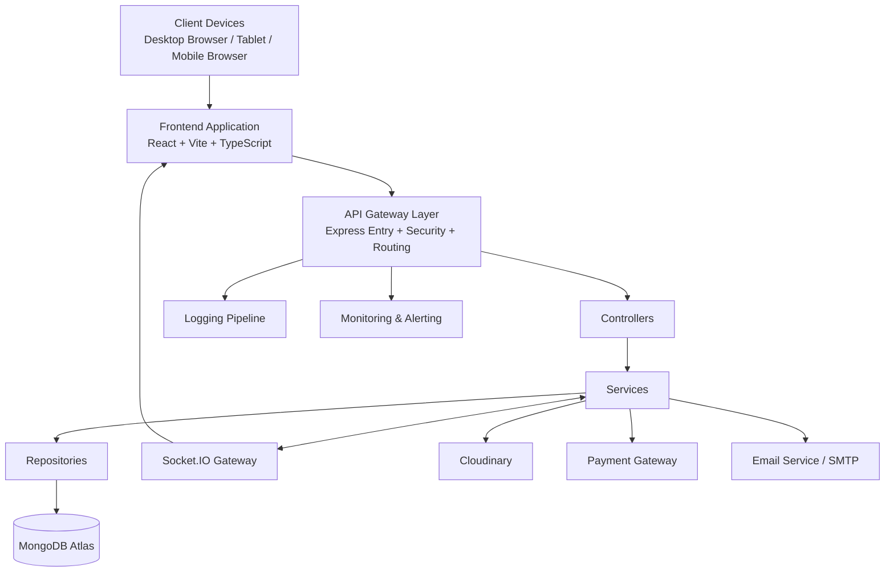
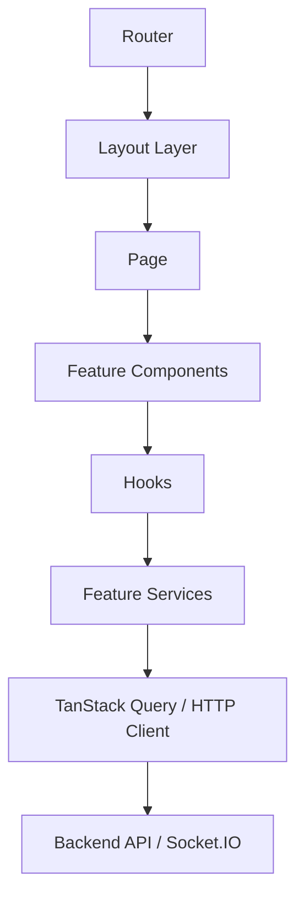
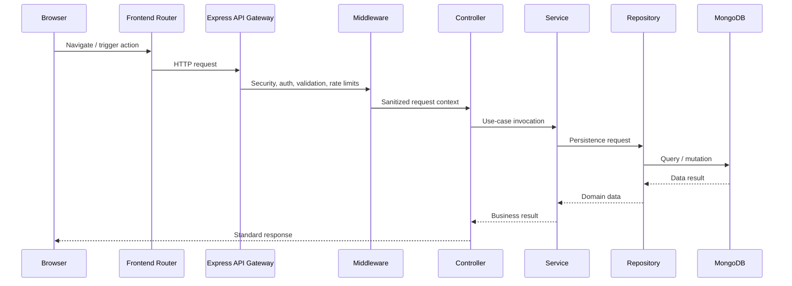
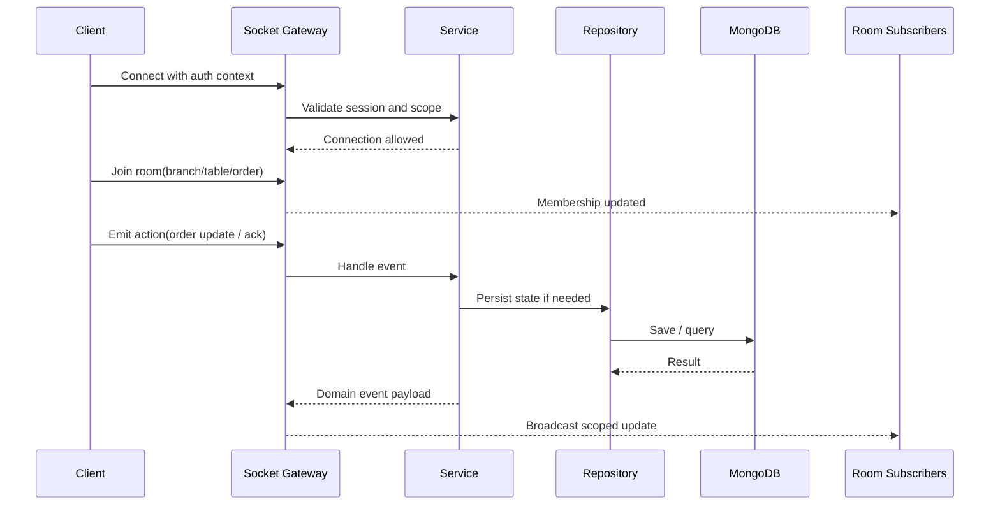
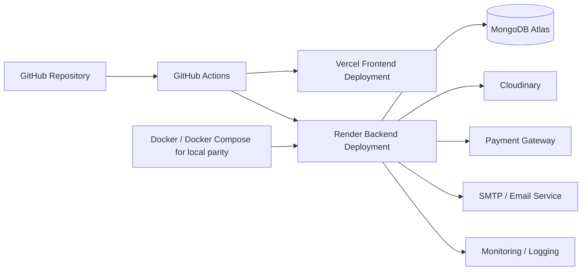

# Software Design Document (SDD)

| Field | Value |
| --- | --- |
| Project | X10Think Restaurant Management System |
| Document Type | Software Design Document |
| Version | 1.0 |
| Status | Architecture Baseline |
| Date | August 1, 2026 |
| Reference Inputs | Project Constitution, Prompt 01, Prompt 02 SRS |
| Purpose | Define how the system will be architected, organized, secured, deployed, and evolved |

## 1. Architecture Goals

| Goal | Design Position | Justification |
| --- | --- | --- |
| Scalability | Use a cloud-native web architecture with independent frontend and backend applications, stateless APIs, event-driven real-time updates, and horizontally scalable service instances. | Restaurant traffic is bursty and branch growth should not require architectural redesign. |
| Maintainability | Use feature-based organization with layered responsibilities and strict module boundaries. | Teams can change one business area without destabilizing unrelated workflows. |
| Performance | Optimize for fast operational workflows, server-state caching, paginated queries, and selective real-time events. | Restaurant staff work in time-sensitive environments where delay directly affects service quality. |
| Security | Apply strong authentication, RBAC, input validation, audit logging, rate limiting, and secret isolation. | The platform handles financial actions, privileged administration, and customer data. |
| Availability | Keep frontend and backend independently deployable, use managed cloud infrastructure, and design operational observability into the system. | Live restaurant operations require dependable service during peak hours. |
| Extensibility | Use modular features, shared contracts, and integration boundaries for payments, media, messaging, and future tenant growth. | The roadmap includes multi-branch, multi-restaurant, AI, and integration expansion. |
| Modularity | Separate domain modules such as orders, kitchen, inventory, and payments, while preserving a consistent architectural template. | Clear boundaries reduce coupling and improve testability and onboarding. |
| Testability | Keep controllers thin, isolate business logic in services, validate inputs consistently, and define deterministic integration points. | Reliable regression testing depends on predictable layers and explicit responsibilities. |

## 2. High Level Architecture



### 2.1 Layer Explanation

| Layer | Responsibility | Justification |
| --- | --- | --- |
| Client | Hosts customer and staff interactions through browser-based interfaces. | Browser delivery keeps distribution simple for restaurants and customers. |
| Frontend (React) | Renders role-based experiences, forms, navigation, cached server state, and real-time updates. | React supports modular component composition and responsive dashboards. |
| API Gateway (Express) | Serves as the application entry point for routing, security middleware, request normalization, throttling, and cross-cutting concerns. | A dedicated ingress layer keeps delivery predictable and centralizes policy enforcement. |
| Controllers | Translate HTTP or socket requests into application use cases and return standardized responses. | Thin controllers preserve separation of concerns and simplify testing. |
| Services | Execute business logic, workflow rules, permission-aware behavior, and orchestration across dependencies. | Service-centric design concentrates business rules in one maintainable layer. |
| Repositories | Encapsulate persistence access and query composition for domain data sources. | Repository abstraction reduces duplication and protects services from storage details. |
| MongoDB | Stores operational, transactional, administrative, and audit data. | Document persistence fits evolving restaurant workflows while supporting high-read operational patterns. |
| Socket.IO | Distributes real-time events for orders, kitchen, reservations, notifications, and dashboards. | Real-time coordination is essential for floor and kitchen synchronization. |
| Cloudinary | Stores and serves optimized media assets such as menu images and brand assets. | Media storage is non-core infrastructure and should be delegated to a managed service. |
| Payment Gateway | Handles payment authorization, settlement, and refunds through controlled integration boundaries. | Financial processing requires external certified providers rather than custom payment handling. |
| Email Service | Sends password reset, reservation, invoice, and operational notification emails. | Email is a separate delivery concern that should not be embedded in core business logic. |
| Logging | Captures application, security, payment, inventory, and audit telemetry. | Operations and compliance require traceability across critical workflows. |
| Monitoring | Tracks uptime, response health, failures, and abnormal behavior. | Architecture must support proactive issue detection instead of reactive debugging. |

### 2.2 Architectural Interpretation

The platform is designed as a modular SaaS web system with one frontend application and one backend application at the initial stage, but with boundaries that support later service extraction if justified by scale. This is preferred over premature microservices because early restaurant workflows share tight business coordination and must evolve quickly under one consistent governance model.

## 3. Architecture Pattern

| Pattern | Why It Is Used | Justification | Trade-offs |
| --- | --- | --- | --- |
| Feature-Based Architecture | Organizes code and ownership around business capabilities such as orders, inventory, and payments. | The system is domain-heavy and benefits from vertical feature encapsulation. | Cross-feature standards must be enforced carefully to avoid drift. |
| Layered Architecture | Separates routing, orchestration, business logic, and persistence concerns. | Clear layering improves maintainability, debugging, and test structure. | More files and indirection than flat designs. |
| MVC | Uses models, controllers, and structured flow for request handling. | A familiar request-response pattern improves backend consistency. | MVC alone is insufficient, so it is strengthened by service and repository layers. |
| Service Layer | Centralizes business logic and orchestration outside controllers. | Restaurant workflows contain policy-heavy logic that must stay reusable and testable. | Requires discipline to prevent leakage into controllers or repositories. |
| Repository Pattern | Abstracts data access for complex business modules and future storage evolution. | Query reuse and persistence isolation matter once modules expand. | Can be excessive for trivial reads if applied dogmatically. |
| Dependency Injection | Used selectively for infrastructure dependencies, strategy selection, and test seams. | Improves substitution for mailers, payments, storage, and future background processing. | Adds abstraction overhead if overused for simple internal code paths. |
| Component-Based Frontend | Breaks UI into reusable presentational and feature components. | Dashboards and role-based workflows share patterns but differ in behavior. | Requires thoughtful composition to avoid an oversized shared component library. |
| RESTful APIs | Standardizes synchronous business operations and external client access. | REST is predictable for web clients, admin tooling, and future integrations. | Real-time and workflow streaming concerns still need Socket.IO beside REST. |

## 4. Module Breakdown

### 4.1 Identity, Governance, and Organization Modules

| Module | Purpose | Responsibilities | Dependencies | Inputs | Outputs | Design Justification |
| --- | --- | --- | --- | --- | --- | --- |
| Authentication | Establish user identity and session lifecycle. | Login, logout, password reset, token issuance, session validation, lockout support. | User, employee, customer, notification, audit log, settings. | Credentials, reset requests, verification tokens. | Auth session state, access tokens, login outcome. | Identity must be isolated because every protected module depends on it. |
| Authorization | Enforce action-level access control. | Permission evaluation, resource scope checks, policy enforcement, access denial logging. | Authentication, role, permission, branch, audit log. | Authenticated principal, requested action, target resource context. | Allow or deny decision, permission context. | Centralized authorization avoids inconsistent role handling across modules. |
| Restaurant | Represent the top-level business entity. | Restaurant identity, operating policy, branding, service modes, profile governance. | Settings, branch, audit log, notification. | Restaurant profile and policy values. | Active restaurant configuration. | Restaurant-level configuration should be authoritative for branch inheritance. |
| Branch | Model individual operating locations. | Branch lifecycle, branch-level settings, assignment context, local operating state. | Restaurant, employee, table, menu, inventory, analytics. | Branch profile, schedules, assignments. | Branch state and branch-scoped context. | Branch is a first-class domain boundary required for multi-location scaling. |
| Employee | Manage staff records and branch affiliation. | Employee profile, employment status, role assignment, branch mapping. | Role, branch, audit log, authentication. | Employee details, assignments, status updates. | Staff directory, active staff state. | Staff identity must be separate from access roles so operations and HR-like records stay coherent. |
| Role | Define reusable access groupings. | Role creation, lifecycle, mapping surface for permissions. | Permission, employee, audit log. | Role metadata and scope rules. | Role catalog and assignments. | Roles simplify governance compared with per-user access control. |
| Permission | Define granular system capabilities. | Permission definitions, mapping, overrides, policy grouping. | Role, authorization, audit log. | Permission assignments and policy changes. | Effective permission model. | Fine-grained permissioning is required for cash, inventory, and admin actions. |
| Settings | Hold configurable system behavior. | Operational policies, feature flags, thresholds, integrations, tenant-level configuration. | Restaurant, branch, auth, payments, notifications, audit log. | Config values, toggle states, thresholds. | Effective runtime configuration. | Config isolation prevents business policy from hardcoding into application logic. |
| Audit Logs | Preserve accountability and forensic history. | Sensitive action recording, searchable event history, compliance evidence. | All modules, logging, reporting, security monitoring. | Action context, actor, timestamp, change details. | Immutable or protected audit events. | Auditability is foundational for finance, permissions, and incident response. |

### 4.2 Customer and Service Flow Modules

| Module | Purpose | Responsibilities | Dependencies | Inputs | Outputs | Design Justification |
| --- | --- | --- | --- | --- | --- | --- |
| Customer | Maintain customer identity and engagement state. | Profile, preferences, visit history, loyalty context, communication readiness. | Authentication, reservation, cart, orders, loyalty, reviews. | Customer registration and preference data. | Customer profile and engagement history. | Customer behavior spans ordering, loyalty, reviews, and analytics, so it deserves its own domain. |
| Menu | Expose purchasable offerings. | Item lifecycle, pricing, visibility, channel availability, modifier support. | Category, inventory, settings, AI recommendation, QR ordering. | Menu item attributes and availability rules. | Active menu catalog and item state. | Menu data changes frequently and affects multiple customer-facing flows. |
| Category | Organize menu navigation and reporting. | Category structure, display order, visibility control. | Menu, analytics, reports. | Category metadata and ordering. | Structured browsing hierarchy. | Menu discovery and operational reporting both depend on stable category structure. |
| Table | Model dine-in seating resources. | Capacity, occupancy, zone, state transitions, assignment context. | Branch, reservation, waiter, orders. | Table metadata and occupancy actions. | Table map and live table state. | Table management is central to dine-in efficiency and reservation integrity. |
| Reservation | Coordinate future dining commitments. | Reservation lifecycle, seating eligibility, waitlist, confirmation flow. | Customer, table, branch, notifications, audit log. | Reservation requests, party size, time slot. | Reservation status and seating plan impact. | Reservations require dedicated rules around timing, capacity, and conflict prevention. |
| Cart | Support pre-order composition for self-service flows. | Item staging, modifier selection, coupon pre-validation, totals preview. | Customer, menu, coupons, loyalty, QR ordering. | Item selections, quantities, notes. | Validated cart snapshot. | Cart behavior changes faster than order persistence and should remain a separate transient concern. |
| Orders | Own the operational order lifecycle. | Order creation, edits, status transitions, channel handling, fulfillment orchestration. | Customer, waiter, kitchen, cashier, payments, inventory, notifications. | Order payload, service context, status actions. | Order record, status timeline, downstream events. | Orders are the core operational aggregate connecting most of the platform. |
| Kitchen | Manage preparation visibility and station coordination. | Ticket queue, prep status, readiness updates, exception signaling. | Orders, menu, inventory, notifications, socket. | Incoming tickets, status actions, item constraints. | Preparation queue and readiness state. | Kitchen flow requires specialized real-time handling distinct from generic order processing. |
| Waiter | Provide floor-service execution support. | Table service actions, dine-in order entry, service follow-up, guest assistance. | Table, orders, customer, reservation, socket. | Service actions, table actions, order updates. | Waiter task views and order outcomes. | Waiter workflows are role-specific and must remain streamlined for speed. |
| Cashier | Handle settlement operations. | Billing, payment initiation, split bills, discount checks, receipt handoff. | Orders, payments, invoices, coupons, loyalty, audit log. | Bill selection, payment method, adjustment instructions. | Payment attempt state, settlement outcome. | Cash handling needs distinct screens, permissions, and auditability. |
| Dashboard | Provide consolidated operational visibility. | Role-specific summaries, KPIs, alerts, task surfacing, exceptions. | Orders, kitchen, inventory, payments, reservations, analytics, notifications. | Filter state, branch context, user role. | Summaries, widgets, alerts, trend views. | Dashboards aggregate read-heavy data and must be treated as a composition layer, not a core transaction source. |
| QR Ordering | Convert table-linked entry points into self-service ordering sessions. | Session resolution, table association, guest ordering, contextual validation. | Menu, cart, orders, table, customer. | QR token context and cart actions. | Context-aware order session and submitted order. | QR flows are operationally distinct from staff-entered orders and need their own context rules. |
| Delivery | Manage off-premise fulfillment flow. | Dispatch state, address handling, partner status, completion evidence. | Orders, customer, notifications, payments, analytics. | Delivery details, assignment status, milestone events. | Delivery lifecycle and customer visibility. | Delivery introduces separate operational milestones and third-party dependencies. |
| AI Recommendation | Suggest relevant items and upsells. | Context interpretation, recommendation retrieval, display eligibility. | Customer, menu, analytics, cart, orders, settings. | Customer context, cart context, behavior signals. | Ranked suggestions and suggestion telemetry. | Recommendation logic should remain optional and loosely coupled to preserve core ordering stability. |

### 4.3 Finance, Inventory, and Procurement Modules

| Module | Purpose | Responsibilities | Dependencies | Inputs | Outputs | Design Justification |
| --- | --- | --- | --- | --- | --- | --- |
| Payments | Manage financial transaction state. | Payment initiation, settlement capture, failure handling, refund status, reconciliation references. | Orders, cashier, invoices, audit log, notification, external gateway. | Amount, method, transaction result, refund request. | Payment record and settlement status. | Payment state must be isolated from order state so failures can be managed safely. |
| Invoices | Produce formal bill artifacts and billing history. | Invoice generation, numbering, delivery readiness, printable record access. | Orders, payments, customer, cashier, notification. | Finalized charge breakdown and payment result. | Invoice artifact and invoice reference. | Invoicing is a downstream financial artifact and should not be mixed into payment execution logic. |
| Inventory | Maintain live stock and thresholds. | Balance visibility, adjustment handling, stock monitoring, availability influence. | Ingredients, suppliers, purchase orders, stock movement, menu, analytics. | Stock events, counts, thresholds. | Current inventory state, alerts. | Inventory needs an operationally authoritative source for menu availability and purchasing decisions. |
| Ingredients | Define stock-tracked consumables. | Ingredient catalog, unit consistency, operational status. | Inventory, menu, purchase orders, suppliers. | Ingredient definitions and units. | Reference ingredient list. | Ingredient modeling must remain separate from menu to support procurement and wastage analysis. |
| Suppliers | Maintain vendor relationships. | Supplier profiles, active status, purchasing eligibility, contact readiness. | Ingredients, purchase orders, inventory, notifications. | Supplier details and service status. | Supplier directory and supplier availability state. | Procurement workflows require clean vendor identity and lifecycle boundaries. |
| Purchase Orders | Drive replenishment workflows. | PO creation, approval, supplier issuance, receipt status, closure. | Suppliers, inventory, ingredients, notifications, audit log. | Replenishment requests and approval actions. | PO lifecycle and expected stock impact. | Procurement has its own approval and fulfillment process separate from stock movement. |
| Reviews | Capture qualitative customer feedback. | Review submission, moderation state, visibility control. | Customer, orders, analytics, notifications. | Review text and linked experience context. | Review records and moderation state. | Text feedback has different lifecycle and moderation needs than numeric ratings. |
| Ratings | Capture structured customer scoring. | Rating submission, aggregate scoring, dimension handling. | Customer, orders, analytics, reviews. | Scores and rating context. | Rating metrics and trend signals. | Structured ratings are easier to analyze and should be modeled separately from review text. |
| Coupons | Manage promotional discount programs. | Coupon lifecycle, rule validation, redemption tracking, campaign visibility. | Cart, cashier, orders, payments, settings, audit log. | Coupon code and eligibility context. | Discount result and usage state. | Promotions carry fraud and margin risk, so rules should be isolated and measurable. |
| Loyalty | Manage retention and reward rules. | Enrollment, point accrual, redemption, tier visibility, benefit history. | Customer, orders, cashier, coupons, analytics. | Eligible transactions, redemption requests. | Loyalty balances and reward state. | Loyalty is a long-lived customer domain and should not be collapsed into checkout logic. |

### 4.4 Platform, Insight, and Communication Modules

| Module | Purpose | Responsibilities | Dependencies | Inputs | Outputs | Design Justification |
| --- | --- | --- | --- | --- | --- | --- |
| Notifications | Route operational and customer-facing communication. | Event fan-out, channel selection, priority handling, delivery status. | Orders, reservations, kitchen, payments, settings, socket, email. | Trigger event, target audience, priority. | Delivered or queued notifications. | Communication policy must stay centralized to avoid duplicated event messaging logic. |
| Reports | Provide operational and business summaries. | Filtered summaries, exports, historical reporting, governance reporting. | Orders, payments, inventory, customers, audit logs, branches. | Date range, branch filters, report type. | Structured report result sets. | Reporting should consume trusted records rather than embed operational logic. |
| Analytics | Deliver trend and performance insights. | KPI computation, trend views, comparison models, anomaly surfacing. | Reports, orders, customers, inventory, payments, reviews, ratings. | Aggregation filters and time windows. | Analytical metrics and insight payloads. | Analytics is read-heavy and should remain separated from transactional modules. |

### 4.5 Platform Module Note

The dashboard, reports, analytics, notifications, and audit modules are deliberately designed as composition and observability layers. They must consume authoritative business data from transactional modules rather than becoming hidden sources of truth themselves.

## 5. Frontend Architecture

### 5.1 Frontend Design Principles

| Area | Design | Justification |
| --- | --- | --- |
| Feature Folders | Organize frontend code by feature modules with `components`, `pages`, `hooks`, `services`, `types`, `validation`, and `constants`. | Keeps UI, data access, and validation close to each business capability. |
| Layouts | Provide role-aware shells such as public, authenticated, operations, admin, and full-screen utility layouts. | Shared navigation and guard logic should not be duplicated across pages. |
| Pages | Treat pages as route-level composition units, not business-logic holders. | Pages should assemble features and orchestration hooks while remaining thin. |
| Components | Split into shared UI primitives and feature-specific components. | This balances reusability with domain clarity and prevents a bloated shared layer. |
| Hooks | Use hooks for local interaction logic, server-state composition, and UI behavior. | Hooks keep components declarative and testable. |
| Services | Centralize frontend API calls and request-specific adapters per feature. | API usage should be versionable and isolated from visual components. |
| Contexts | Reserve Context API for low-frequency global concerns such as auth session, theme, active branch, and notification preferences. | Context is useful for cross-cutting state, but should not become a general state container. |
| Utilities | Keep formatting, date handling, permission helpers, and transformation functions in shared utilities. | Cross-feature helpers should remain deterministic and framework-light. |
| Constants | Keep route names, role identifiers, UI limits, query keys, and display enums centralized. | Eliminates hardcoded values scattered through pages and components. |

### 5.2 Frontend Composition Model



### 5.3 Routing and Protected Routes

| Concern | Design Decision | Justification |
| --- | --- | --- |
| Routing | Use React Router with route objects grouped by domain and user scope. | Centralized routing improves role-based navigation governance. |
| Protected Routes | Apply auth guards and permission guards at layout or route-boundary level. | Guarding early prevents unauthorized components from mounting or fetching data. |
| Route Metadata | Each route should carry title, required permission, breadcrumb, and layout metadata. | Improves consistent navigation, SEO-safe titles, and access checks. |
| Route-Level Error Boundaries | Use route-level fallback and error surfaces for failures. | Operational users need controlled failure messaging instead of blank screens. |

### 5.4 Lazy Loading Strategy

| Area | Design | Justification |
| --- | --- | --- |
| Feature Routes | Lazily load large route modules such as reports, analytics, admin settings, and delivery dashboards. | Reduces initial bundle cost for role-specific areas. |
| Charts and Heavy Visuals | Load charting and advanced visual assets only when required. | Operational speed on first load matters more than eager access to rarely used analytics. |
| Shared Shell | Keep auth, routing, top navigation, and essential dashboard shell eagerly available. | Core navigation must remain fast and reliable after login. |

### 5.5 Frontend State Boundaries

| State Type | Ownership | Examples | Justification |
| --- | --- | --- | --- |
| Local UI State | Component or page | modal visibility, filters, input drafts, open sections | Fast, transient, and not worth global coordination. |
| Context State | Application-wide low-churn contexts | auth session, active branch, theme, notification preferences | Shared across many routes but updated infrequently. |
| Server State | TanStack Query | orders, reservations, tables, inventory, dashboard cards | Must stay cache-aware, synchronized, and invalidation-driven. |
| Real-Time Ephemeral State | Socket listeners plus query cache reconciliation | kitchen ticket arrivals, payment result notifications, readiness alerts | Real-time changes should enhance server state without replacing the source of truth. |

## 6. Backend Architecture

### 6.1 Backend Layer Design

| Layer | Responsibility | Justification |
| --- | --- | --- |
| Config | Load validated environment variables, service settings, and runtime options. | Configuration failures must stop the app early and predictably. |
| Routes | Register versioned endpoints and module entry points. | Route registration should remain declarative and consistent. |
| Controllers | Validate request shape handoff, call services, map service result to response. | Keeps HTTP mechanics separate from business rules. |
| Services | Enforce workflows, policies, and orchestration across dependencies. | The service layer is the heart of business logic and reuse. |
| Repositories | Encapsulate data reads and writes, query strategies, and persistence concerns. | Prevents query duplication and persistence leakage into services. |
| Models | Define domain entities, status enums, and persistence-facing structures. | Shared language and consistency require canonical domain structures. |
| Validators | Validate request payloads, params, query objects, and configuration shapes. | Input validation must be standardized and close to system boundaries. |
| Middlewares | Handle auth, rate limiting, request context, error handling, and permission gates. | Cross-cutting concerns should not pollute controllers. |
| Utilities | Provide reusable formatting, mapping, response helpers, and domain-safe helpers. | Utilities reduce duplication without creating hidden domain logic. |
| Socket | Manage real-time namespaces, authentication, room membership, and event publishing. | Real-time flow needs its own structured gateway rather than ad hoc emissions. |
| Logging | Capture structured logs and correlation context. | Debugging, auditing, and support require consistent observability. |
| Documentation | Preserve architecture, environment, API behavior, and operational guidance. | Enterprise delivery requires durable documentation beyond code comments. |
| Tests | Cover validators, services, repositories, routes, and real-time behavior. | Layered tests reflect layered architecture and reduce regression risk. |

### 6.2 Backend Execution Rule

Controllers must remain orchestration-only. Services own business rules. Repositories own persistence semantics. This separation is non-negotiable because restaurant domains such as payments, discounts, inventory movement, and permission checks are too risky to scatter across random request handlers.

## 7. Folder Structure

### 7.1 Final Production Workspace Structure

```text
X10Think-Restaurant-Management-System/
├── apps/
│   ├── web/
│   │   ├── public/
│   │   ├── src/
│   │   │   ├── app/
│   │   │   │   ├── layouts/
│   │   │   │   ├── providers/
│   │   │   │   ├── router/
│   │   │   │   └── guards/
│   │   │   ├── features/
│   │   │   │   ├── auth/
│   │   │   │   ├── dashboard/
│   │   │   │   ├── orders/
│   │   │   │   ├── kitchen/
│   │   │   │   ├── inventory/
│   │   │   │   └── ...
│   │   │   ├── shared/
│   │   │   │   ├── components/
│   │   │   │   ├── constants/
│   │   │   │   ├── hooks/
│   │   │   │   ├── lib/
│   │   │   │   ├── types/
│   │   │   │   └── utils/
│   │   │   └── styles/
│   │   └── tests/
│   └── api/
│       ├── src/
│       │   ├── config/
│       │   ├── features/
│       │   │   ├── auth/
│       │   │   │   ├── routes/
│       │   │   │   ├── controllers/
│       │   │   │   ├── services/
│       │   │   │   ├── repositories/
│       │   │   │   ├── models/
│       │   │   │   ├── validators/
│       │   │   │   ├── middlewares/
│       │   │   │   └── types/
│       │   │   ├── orders/
│       │   │   ├── inventory/
│       │   │   ├── payments/
│       │   │   └── ...
│       │   ├── routes/
│       │   ├── shared/
│       │   │   ├── errors/
│       │   │   ├── middlewares/
│       │   │   ├── types/
│       │   │   ├── utils/
│       │   │   └── validators/
│       │   ├── sockets/
│       │   └── tests/
│       └── scripts/
├── packages/
│   ├── shared-contracts/
│   ├── shared-types/
│   └── shared-config/
├── docs/
│   ├── software-requirements-specification.md
│   ├── software-design-document.md
│   ├── architecture.md
│   ├── deployment.md
│   └── ...
├── deployment/
│   ├── docker/
│   ├── render/
│   ├── vercel/
│   └── monitoring/
├── .github/
│   └── workflows/
├── package.json
└── tsconfig.base.json
```

### 7.2 Structure Rationale

| Area | Rationale |
| --- | --- |
| `apps/web` | Keeps browser delivery concerns isolated from backend runtime concerns. |
| `apps/api` | Keeps request handling, business logic, real-time infrastructure, and persistence logic together but modularized by feature. |
| `packages` | Supports future shared contracts and configuration without mixing runtime-specific concerns. |
| `docs` | Preserves architecture, requirements, testing, and deployment reference material as first-class artifacts. |
| `deployment` | Separates deployment and platform definitions from application logic. |
| `.github/workflows` | Centralizes CI/CD automation and policy enforcement. |

## 8. Communication Flow

### 8.1 HTTP Request Lifecycle



### 8.2 HTTP Flow Explanation

1. The browser or staff device initiates a route action or form submission.
2. The frontend router determines the page context and triggers service calls.
3. The Express gateway applies request-level protections and cross-cutting middleware.
4. Controllers convert the normalized request into a business use case.
5. Services execute validation-dependent business rules and orchestrate dependencies.
6. Repositories execute persistence interactions.
7. Responses return through the same path using standardized payload shapes.

### 8.3 Socket.IO Event Flow



### 8.4 Real-Time Flow Design Rule

Socket events must reflect business events already validated by the service layer. Socket.IO may speed up visibility, but it must never become the system of record.

## 9. State Management Design

| Concern | Design | Justification |
| --- | --- | --- |
| Local State | Use component or page state for transient UI concerns. | Prevents over-centralization of small interaction details. |
| Context API | Use for low-frequency global concerns such as auth session, branch context, and theme. | Context is efficient for broad but low-churn state. |
| TanStack Query | Use for server state fetching, caching, invalidation, background refresh, and optimistic update coordination. | Operational screens depend on fresh server state with minimal boilerplate. |
| Server State | Treat server data as authoritative and cache it by resource and scope. | Orders, tables, reservations, and inventory should reconcile against backend truth. |
| Caching | Cache by feature, branch, user scope, and query parameters. | Restaurant data is highly contextual and must avoid stale cross-branch leakage. |
| Optimistic Updates | Use only for reversible, low-risk interactions such as local status toggles and acknowledged UI actions. | High-risk actions like payments or irreversible inventory adjustments require confirmed server truth. |
| Invalidation Strategy | Invalidate by feature key and business event, such as order status change, payment completion, or inventory movement. | Event-driven invalidation is more accurate than broad full-cache resets. |

## 10. Configuration Strategy

| Area | Design | Justification |
| --- | --- | --- |
| Environment Variables | Keep secrets and environment-specific endpoints outside source code. | Sensitive and deployment-varying values must not be hardcoded. |
| Application Config | Build a validated config object at startup and share it through controlled access points. | Early validation prevents unstable runtime behavior. |
| Constants | Store stable application identifiers, query keys, roles, statuses, and limits in typed constants. | Stable shared values should remain explicit and searchable. |
| Secrets | Restrict secrets to backend runtime and deployment platforms; never expose them to the browser. | Prevents credential leakage and preserves least privilege. |
| Feature Flags | Use settings-backed flags for controlled rollout of optional flows such as AI recommendation or push notifications. | Allows safe incremental release without code branching chaos. |

### 10.1 Configuration Ownership

| Config Type | Owner | Example Scope |
| --- | --- | --- |
| Runtime secret | Platform and backend ops | JWT secrets, SMTP credentials, payment keys |
| Public frontend config | Frontend runtime | API base URL, public app title |
| Business policy | Admin and authorized business owners | refund rules, reservation grace time, coupon stacking |
| Feature rollout | Product and admin governance | AI recommendation toggle, delivery enablement |

## 11. Logging Strategy

| Log Stream | Source | Required Content | Justification |
| --- | --- | --- | --- |
| Application Logs | API and frontend observability points | request IDs, module, action, latency, outcome | Core troubleshooting depends on structured app traces. |
| Authentication Logs | Auth and access middleware | login attempts, password reset events, denied access, suspicious behavior | Identity incidents require explicit traceability. |
| Payment Logs | Payment service and cashier workflows | payment reference, step, gateway response class, refund activity | Financial errors must be diagnosable and auditable. |
| Inventory Logs | Inventory and stock movement modules | movement type, actor, source reason, affected items | Inventory disputes require event-level reconstruction. |
| Audit Logs | Sensitive administrative and business actions | actor, before-after context, permission scope, timestamp | Compliance and accountability depend on durable high-signal records. |
| System Logs | Platform health, boot, shutdown, dependency failures | process state, environment, infra errors, socket events | Operations teams need infrastructure-aware service visibility. |

## 12. Error Handling Strategy

| Error Type | Handling Design | Justification |
| --- | --- | --- |
| Global Errors | Route all unhandled backend errors through a centralized error handler with structured mapping. | Ensures consistent responses and avoids leaking internal details. |
| Custom Error Classes | Define typed errors for validation, auth, authorization, business logic, payment, and infrastructure failures. | Explicit error categories improve client behavior and observability. |
| Validation Errors | Reject invalid inputs at the boundary with field-aware responses. | Invalid requests should fail early before touching business logic. |
| Authentication Errors | Return clear unauthorized outcomes without exposing credential details. | Security-sensitive failures must be predictable but not verbose. |
| Authorization Errors | Return forbidden outcomes and log the attempt with scope context. | Access denials are both UX and security events. |
| Business Errors | Represent domain rule violations such as invalid status change or coupon misuse. | Business failures should be readable and deterministic. |
| Database Errors | Normalize persistence failures into safe application-level messages and operational logs. | Raw data-layer errors are noisy and unsafe for clients. |
| Payment Errors | Separate provider failure, validation failure, and settlement uncertainty. | Financial flows need granular recovery handling. |
| Socket Errors | Emit scoped error events with reconnection-safe semantics. | Real-time clients need actionable errors without destabilizing the connection. |

### 12.1 Error Handling Rule

Errors must be expressed as domain-meaningful outcomes at the service boundary. Infrastructure details belong in logs and monitoring, not in end-user responses.

## 13. File Upload Architecture

| Area | Design | Justification |
| --- | --- | --- |
| Storage Provider | Use Cloudinary for menu images, brand assets, and approved media uploads. | Managed media hosting reduces storage complexity and supports transformation delivery. |
| Upload Entry | Route uploads through backend validation instead of direct unaudited public writes. | Backend mediation supports permission checks and auditability. |
| Image Validation | Validate mime type, size, extension, and business context before upload acceptance. | Prevents abuse, unexpected formats, and oversized payloads. |
| Compression | Optimize image size before or during managed transformation handling. | Restaurant users need fast media delivery on mixed network conditions. |
| Storage Strategy | Store only metadata and provider references in the core database. | Binary assets should not inflate operational persistence complexity. |
| Security | Restrict uploads by role, sanitize filenames and metadata, and reject unsupported file types. | Upload surfaces are high-risk and must be hardened. |

## 14. Real-Time Architecture

### 14.1 Namespace Strategy

| Namespace | Purpose | Justification |
| --- | --- | --- |
| `/operations` | Orders, tables, waiter events, cashier refreshes | Shared operational state belongs in one business namespace. |
| `/kitchen` | Ticket queues, readiness, item availability signals | Kitchen events have specialized consumers and event vocabulary. |
| `/notifications` | Alert delivery, badge counts, admin notices | Notification concerns should stay isolated from transactional event noise. |
| `/admin` | Governance-level real-time updates if needed | Restricts elevated operational awareness to authorized users. |

### 14.2 Room Strategy

| Room Type | Example | Justification |
| --- | --- | --- |
| Branch Room | `branch:<branchId>` | Most restaurant operations are branch-scoped. |
| Table Room | `table:<tableId>` | Dine-in status changes often matter at table granularity. |
| Order Room | `order:<orderId>` | Customer and staff can subscribe to a single order timeline. |
| Role Room | `role:kitchen` | Efficient fan-out for role-specific visibility. |
| User Room | `user:<userId>` | Supports targeted notifications and session-safe updates. |

### 14.3 Event Design

| Event Group | Example Event Types | Justification |
| --- | --- | --- |
| Order Events | created, accepted, in-preparation, ready, served, completed | Orders are the main live coordination stream. |
| Kitchen Events | ticket-assigned, delayed, item-unavailable, ready-for-pickup | Kitchen visibility needs precise operational semantics. |
| Reservation Events | created, confirmed, canceled, approaching, seated | Reservation timing affects floor planning. |
| Inventory Alerts | low-stock, out-of-stock, replenished | Inventory issues must surface quickly but selectively. |
| Notification Events | unread-count, alert-pushed, alert-acknowledged | Notification UX should avoid polling-heavy behavior. |

### 14.4 Connection Lifecycle

1. Client connects with authenticated context.
2. Gateway validates identity and role scope.
3. Client joins approved rooms only.
4. Events are accepted only if the actor has permission for the action and scope.
5. Disconnect events are logged when operationally relevant.

### 14.5 Reconnection Strategy

| Concern | Design | Justification |
| --- | --- | --- |
| Temporary network loss | Allow client auto-reconnect with short retry backoff. | Browser and mobile browser connectivity may fluctuate. |
| State recovery | On reconnect, refresh relevant query caches from REST before trusting socket deltas. | Prevents stale local state after missed events. |
| Duplicate events | Make service-driven status transitions idempotent wherever possible. | Reconnects and retries should not corrupt operational state. |

### 14.6 Broadcast Rules

Events must be emitted only to the minimum scope needed. Branch-wide broadcasts are acceptable for shared operational visibility, but sensitive events such as payment status or admin changes must be user- or permission-scoped.

## 15. Notification Architecture

| Channel | Primary Use | Trigger Source | Justification |
| --- | --- | --- | --- |
| Email | Password reset, reservations, invoices, escalations | Auth, reservation, invoices, admin workflows | Email is durable and appropriate for confirmation-grade communication. |
| Real-Time | Kitchen status, dashboard alerts, order readiness, branch operations | Orders, kitchen, notifications, dashboard | Operations require immediate awareness without manual refresh. |
| Toast | In-session UI confirmations and warnings | Frontend interactions and real-time listeners | Toasts provide lightweight feedback without interrupting work. |
| Push Notifications (Future) | Mobile reminders and off-session alerts | Notification service | Push is valuable later once mobile or PWA flows mature. |

### 15.1 Notification Routing Rule

Notifications must be event-driven and policy-aware. Business services publish notification intents, while the notification module decides channel, audience, and delivery mode.

## 16. Caching Strategy

| Layer | Strategy | Justification |
| --- | --- | --- |
| Frontend Cache | Use TanStack Query cache keyed by feature, scope, and filters. | Client-side cache improves speed without inventing a second source of truth. |
| Backend Cache | Keep architecture Redis-ready for future hot data caching, throttling support, and distributed session or socket enhancements. | Future scale may justify shared cache infrastructure, but the initial system should not depend on it. |
| Database Optimization | Use targeted indexes, projection-aware queries, and scoped aggregation. | Operational performance should start with strong persistence design rather than premature external caching. |
| Cache Invalidation | Invalidate on business events such as order update, payment settlement, reservation change, or stock movement. | Event-aware invalidation preserves correctness better than TTL-only strategies. |

## 17. Scalability Strategy

| Scaling Target | Design Approach | Justification |
| --- | --- | --- |
| Multiple Restaurants | Keep restaurant as the top-level business boundary and prepare for tenant-aware scoping in configs, data access, and permissions. | Prevents later redesign when supporting separate business entities. |
| Multiple Branches | Scope core operational data and room membership by branch. | Branch is the natural unit of restaurant operations and reporting. |
| Multiple Kitchens | Allow branch-internal kitchen segmentation by station or prep domain. | Large restaurants often need parallel kitchen visibility models. |
| Multiple Admins | Enforce scope-aware permissions and auditable administrative actions. | Governance becomes more important as control surfaces multiply. |
| Future Multi-Tenant SaaS | Reserve tenant-aware contracts, settings, and deployment assumptions from the start. | Multi-tenant readiness is cheaper to preserve early than retrofit later. |

## 18. Performance Strategy

| Concern | Design | Justification |
| --- | --- | --- |
| Pagination | Paginate large lists such as orders, customers, inventory history, and audit logs. | Prevents oversized payloads and unstable client rendering. |
| Search | Use debounced, indexed, server-assisted search for operational entities. | Staff workflows need fast lookup without overwhelming the backend. |
| Filtering | Apply structured server filters with branch, role, date, status, and channel dimensions. | Domain filtering is essential for actionable dashboards and reports. |
| Sorting | Keep deterministic server-side sorting for operational lists and exports. | Consistent order matters for service accuracy and auditing. |
| Image Optimization | Use managed transformation delivery for menu and brand images. | Media should not slow ordering experiences. |
| Code Splitting | Split by route and heavy capability such as analytics or admin tooling. | Initial load must remain fast for staff and customer sessions. |
| Lazy Loading | Load low-frequency views only when needed. | Reduces upfront resource cost. |
| Database Indexes | Index high-frequency lookups such as order status, branch scope, reservation windows, and inventory thresholds. | Persistence performance is a first-order concern in live operations. |
| Query Optimization | Use lean reads, scoped projections, and aggregation discipline. | Read-heavy dashboards should avoid unnecessary data hydration. |
| Compression | Compress network responses where appropriate. | Helps mixed-bandwidth environments and large reporting payloads. |

## 19. Deployment Architecture



### 19.1 Deployment Design

| Component | Platform | Design Decision | Justification |
| --- | --- | --- | --- |
| Frontend | Vercel | Deploy statically built React frontend close to end users with environment-based API targeting. | Frontend hosting benefits from CDN-friendly delivery and simple rollout. |
| Backend | Render | Deploy Express API as a managed web service with environment-level secrets and scaling controls. | Managed container-style hosting simplifies operations for early SaaS growth. |
| Database | MongoDB Atlas | Use managed cloud database with backups, monitoring, and scaling controls. | Core data store needs managed reliability and operational tooling. |
| Media | Cloudinary | Offload media storage and transformation. | Avoids local file persistence complexity on stateless app instances. |
| Payments | External Gateway | Integrate through backend-only credentials and scoped service adapters. | Payment security and compliance demand provider isolation. |
| SMTP / Email | External Provider | Use an external email provider with backend-mediated delivery. | Email should be observable, configurable, and replaceable. |
| GitHub Actions | CI/CD | Run checks, builds, and deployment automation from the source repository. | Standardized automation improves repeatability and team discipline. |
| Docker | Local and future infra parity | Use for local reproducibility and future environment standardization. | Docker improves consistency without forcing early infrastructure complexity. |

## 20. Architecture Decision Records (ADR)

| Decision | Reason | Advantages | Trade-offs | Future Impact |
| --- | --- | --- | --- | --- |
| Monorepo with separate apps | Keep frontend and backend coordinated while maintaining clear deployment boundaries. | Easier shared governance and version alignment. | Requires workspace discipline. | Supports future shared packages cleanly. |
| Modular monolith first | Shared domain evolution is faster before scale justifies service extraction. | Lower operational overhead and simpler transactions. | One backend deploy unit initially. | Services can later be split along existing module boundaries. |
| Feature-based organization | Business domains are the primary change axis. | Easier ownership and onboarding. | Requires consistent templates. | Scales well with team growth. |
| Layered backend | Protect business rules from transport and persistence leakage. | Testable and maintainable code flow. | More structural ceremony. | Reduces regression risk in complex modules. |
| React + TanStack Query frontend | Role-driven dashboards need strong UI composition and server-state handling. | Efficient caching and predictable data flows. | Requires query hygiene. | Supports advanced dashboards and real-time reconciliation. |
| REST plus Socket.IO | Synchronous CRUD alone is insufficient for kitchen and operations. | Clear split between request-response and live events. | Two communication paradigms to govern. | Enables responsive operational experiences. |
| MongoDB Atlas | Domain evolves quickly and benefits from flexible document modeling. | Fast iteration and managed operations. | Query discipline is essential. | Works well for branch-scoped operational workloads. |
| Cloudinary for media | Media management is non-core infrastructure. | Optimized delivery and simpler storage operations. | External dependency. | Enables richer menu experiences without storage redesign. |
| External payment provider | Payments must rely on specialized infrastructure. | Better security posture and financial interoperability. | Provider integration complexity. | Allows gateway replacement through adapters later. |
| Redis-ready but not Redis-required | Avoid premature complexity while keeping a cache path open. | Simpler initial deployment. | Fewer backend caching features at first. | Easy scale-up path for hot data and distributed coordination. |

## 21. Risks & Mitigation

| Risk | Impact | Mitigation |
| --- | --- | --- |
| Overly coupled modules during rapid feature growth | Harder maintenance and fragile releases | Enforce module boundaries and service ownership rules from the start. |
| Permission leakage across branches or roles | Security and data exposure incident | Scope every protected action by role and branch context, and log denials. |
| Payment uncertainty or duplicate financial actions | Revenue loss or customer trust issues | Use idempotent payment workflows and explicit settlement state tracking. |
| Real-time event drift from persisted state | Operational confusion | Treat REST-backed service results as authoritative and reconcile on reconnect. |
| Inventory inaccuracies from delayed updates | Stockouts or wastage | Centralize stock movement recording and tie changes to business events. |
| Dashboard performance degradation under scale | Slow operational visibility | Optimize read models, paginate deep history, and cache summaries carefully. |
| Notification overload | Users ignore important alerts | Introduce priority-based routing and role-aware channel selection. |
| Future multi-tenant retrofit cost | Architectural rework | Preserve restaurant and branch scoping as first-class boundaries now. |
| Documentation drift | Team confusion and inconsistent builds | Treat SRS and SDD as controlled artifacts updated alongside major changes. |

## 22. Development Guidelines

| Area | Guideline | Justification |
| --- | --- | --- |
| Coding Standards | Use strict TypeScript, explicit types, meaningful naming, and small focused functions. | Strong typing and clarity improve reliability in business-critical flows. |
| Naming Conventions | Use feature-driven names, domain-oriented identifiers, and stable status enums. | Shared language reduces misinterpretation across teams. |
| Folder Conventions | Keep every feature self-contained and follow the same internal structure. | Predictability reduces onboarding and merge friction. |
| File Naming | Use descriptive, purpose-based file names aligned to layer responsibility. | A file name should reveal both domain and role in the architecture. |
| Import Strategy | Prefer local feature imports within a feature and shared imports only for approved shared assets. | Prevents hidden coupling and feature boundary erosion. |
| Dependency Rules | Features may depend on shared libraries and lower layers, but not sideways on unrelated feature internals. | Preserves modularity and long-term maintainability. |
| Module Boundaries | Business rules stay in services, persistence stays in repositories, transport stays in controllers or sockets. | Clear boundaries prevent architecture drift. |
| Documentation Discipline | Update requirements and design artifacts when architecture or domain policy materially changes. | The architecture blueprint must remain trustworthy. |

### 22.1 Boundary Rules

1. Frontend shared components must stay presentation-focused unless explicitly approved as cross-feature primitives.
2. Backend services may orchestrate multiple repositories, but repositories must not call services.
3. Socket handlers must delegate business decisions to services instead of embedding workflow logic.
4. Analytics and reports must read authoritative operational data rather than create parallel mutable truth.
5. New external integrations must enter through dedicated adapters or service boundaries.

## Approval Basis

This SDD defines the permanent architecture blueprint for the X10Think Restaurant Management System as of August 1, 2026. Future development should implement against this design baseline unless a formally approved architectural change supersedes it.
