# UI/UX Design System and Application Experience Blueprint

| Field | Value |
| --- | --- |
| Project | X10Think Restaurant Management System |
| Document Type | UI/UX Design System and Application Experience Blueprint |
| Version | 1.0 |
| Status | Approved Frontend Experience Baseline |
| Date | August 18, 2026 |
| Reference Inputs | Project Rules, SRS, SDD, Database Design Document, API Design Document, Prompt 06 |
| Authority | This document is the official UI/UX specification for all future X10Think frontend work. |

## 1. Design Objectives

The X10Think experience must feel like a commercial restaurant operations platform rather than a generic CRUD dashboard. The interface must support both fast operational execution and customer self-service while preserving consistency across roles, devices, and workflows.

| Objective | UX Position |
| --- | --- |
| Professional | Polished, business-grade UI with clear hierarchy and minimal visual noise. |
| Modern | Clean surfaces, expressive typography, intentional color, and lightweight motion. |
| Fast | Read-heavy screens optimize scan speed, action density, and low-friction interaction. |
| Responsive | Mobile-first layouts that expand gracefully to tablet, laptop, and large desktop. |
| Accessible | WCAG-oriented color contrast, keyboard support, semantic structure, and touch-safe targets. |
| Intuitive | Role-specific flows use predictable patterns, descriptive labels, and progressive disclosure. |
| Scalable | Shared tokens, shells, components, and patterns prevent design drift as modules grow. |
| Consistent | Every page must use the same visual language, interaction rules, and state handling. |
| Dual-audience ready | Customer journeys feel inviting and retail-oriented; staff journeys feel efficient and operational. |

## 2. Experience Principles

| Principle | Meaning |
| --- | --- |
| Calm under pressure | High-traffic restaurant workflows must stay readable during rush periods. |
| Information at the point of action | Users should not navigate away to confirm critical context. |
| Status before detail | Operational users need priority, readiness, payment, and conflict signals first. |
| Progressive complexity | Advanced options stay hidden until relevant, especially on mobile. |
| Touch-first operations | Waiter, cashier, and kitchen workflows must work on tablet without precision input. |
| Trust through feedback | Every write action must show pending, success, failure, or conflict feedback. |
| One pattern per problem | Similar tasks use the same UI model across modules. |

## 3. Design System

### 3.1 Brand Direction

The visual identity is warm, grounded, and operational. It uses deep neutral structure (`ink`), hospitality warmth (`ember`, `sand`), and stable operational balance (`moss`). The aesthetic should feel premium yet practical, with layered surfaces instead of flat sterile panels.

### 3.2 Core Color Palette

| Token | Hex | Use |
| --- | --- | --- |
| `color.brand.ink.700` | `#0F172A` | Primary headings, key navigation, strong text, charts. |
| `color.brand.ember.500` | `#DC5D2A` | Primary action, active state, focus accents, urgent highlights. |
| `color.brand.sand.400` | `#F6C56F` | Warm accent, loyalty highlights, supporting surfaces. |
| `color.brand.moss.600` | `#315845` | Success-adjacent dashboards, healthy operational indicators. |
| `color.brand.clay.100` | `#F4EDE4` | Warm surface tint and section background. |

### 3.3 Semantic Colors

| Category | Light | Dark | Use |
| --- | --- | --- | --- |
| Primary | `#DC5D2A` | `#F08A5D` | Main CTA, active filters, selected controls. |
| Secondary | `#315845` | `#6E9A84` | Secondary actions, support metrics, non-destructive emphasis. |
| Success | `#1F7A4D` | `#5BC98B` | Confirmations, healthy inventory, completed states. |
| Warning | `#B7791F` | `#F4B860` | Caution, delayed workflow, pending reconciliation. |
| Error | `#C0392B` | `#F07167` | Errors, destructive actions, failed states. |
| Info | `#2563EB` | `#71A7FF` | Tips, neutral notices, tracking information. |

### 3.4 Neutral Palette

| Token | Light | Dark | Use |
| --- | --- | --- | --- |
| `neutral.0` | `#FFFFFF` | `#0B1220` | App background or highest contrast surface depending on theme. |
| `neutral.50` | `#FBF7F1` | `#101827` | Page background. |
| `neutral.100` | `#F5EFE7` | `#172133` | Section background. |
| `neutral.200` | `#E6DDD2` | `#243146` | Borders and dividers. |
| `neutral.400` | `#8A94A6` | `#93A1B6` | Placeholder text, muted metadata. |
| `neutral.600` | `#475569` | `#C5D0DE` | Body text. |
| `neutral.900` | `#0F172A` | `#F8FAFC` | High-emphasis text. |

### 3.5 Surfaces and Backgrounds

| Surface | Light Theme | Dark Theme | Notes |
| --- | --- | --- | --- |
| App canvas | Warm layered gradient using `neutral.50`, `clay.100`, subtle `sand` and `ember` blooms | Deep layered navy using `#09111D`, `#101827`, muted ember glow | Never use plain flat white or flat black across the full app. |
| Primary card | Frosted off-white with subtle border | Deep slate with soft internal contrast | Used for KPI cards, forms, dashboard widgets. |
| Secondary card | Warmer tint surface for grouping | Slightly elevated slate with warm muted border | Used for supporting panels and detail groups. |
| Overlay | 60% neutral scrim with blur | 72% neutral scrim with blur | Used for dialogs and drawers. |

### 3.6 Text Colors

| Role | Light | Dark |
| --- | --- | --- |
| Heading | `#0F172A` | `#F8FAFC` |
| Body | `#475569` | `#C5D0DE` |
| Muted | `#64748B` | `#93A1B6` |
| Inverse | `#FFFFFF` | `#0B1220` |
| Link | `#C24F24` | `#F08A5D` |

### 3.7 Dark Mode Rules

Dark mode must not invert the interface. Warm hospitality accents remain visible, but backgrounds shift to deep slate layers. Charts use recalibrated gridlines and muted fills. Tables gain clearer row separation rather than higher brightness. Danger colors lose saturation slightly to reduce eye fatigue over long shifts.

## 4. Typography

| Element | Font | Size | Weight | Line Height | Notes |
| --- | --- | --- | --- | --- | --- |
| Display hero | Space Grotesk | 40-52 | 700 | 1.05 | Landing pages, major empty states, onboarding. |
| H1 | Space Grotesk | 32-40 | 700 | 1.1 | Primary page heading. |
| H2 | Space Grotesk | 24-30 | 700 | 1.15 | Section heading. |
| H3 | Space Grotesk | 20-24 | 600 | 1.2 | Card group heading. |
| H4 | Manrope | 18-20 | 700 | 1.3 | Table/header grouping. |
| Body L | Manrope | 16 | 500 | 1.6 | Default body copy. |
| Body M | Manrope | 14 | 500 | 1.55 | Dense operational text. |
| Label | Manrope | 13 | 700 | 1.3 | Form labels, badges. |
| Caption | Manrope | 12 | 500 | 1.4 | Metadata, help text. |
| Button | Manrope | 14-15 | 700 | 1.1 | Clear action emphasis. |
| KPI number | Space Grotesk | 28-36 | 700 | 1.0 | Revenue, orders, reservations, uptime. |
| Monospace support | JetBrains Mono or equivalent | 12-13 | 500 | 1.4 | Audit IDs, request IDs, system events. |

### 4.1 Typography Rules

| Rule | Standard |
| --- | --- |
| Headline density | Avoid more than one H1 per page. |
| Sentence case | Use sentence case for UI labels, tabs, and buttons. |
| Letter spacing | Slight negative tracking for display text only. |
| Number clarity | KPI and price values should align tabularly where possible. |
| Responsive scaling | Headings shrink by one scale step below `md`; body text never drops below 14px for operational areas. |

## 5. Spacing System

| Token | Value | Use |
| --- | --- | --- |
| `space.1` | 4px | Icon spacing, tight chips |
| `space.2` | 8px | Badge padding, micro gaps |
| `space.3` | 12px | Inline controls, compact form gaps |
| `space.4` | 16px | Standard control spacing |
| `space.5` | 20px | Dense card padding |
| `space.6` | 24px | Default card padding |
| `space.8` | 32px | Section gaps |
| `space.10` | 40px | Major panel separation |
| `space.12` | 48px | Page section separation |
| `space.16` | 64px | Landing page block spacing |

### 5.1 Layout Spacing Rules

| Area | Standard |
| --- | --- |
| Mobile page padding | 16px |
| Tablet page padding | 24px |
| Desktop page padding | 32px |
| Large desktop max width | 1440px content frame |
| Form vertical gap | 16px default, 24px between groups |
| Card internal gap | 16px default, 24px for detail cards |
| Dashboard widget gap | 24px |

## 6. Border, Radius, and Stroke System

| Token | Value | Use |
| --- | --- | --- |
| Border thin | 1px | Inputs, cards, separators |
| Border strong | 2px | Focus ring anchor, error emphasis |
| Radius xs | 8px | Badges, chips |
| Radius sm | 12px | Inputs, buttons |
| Radius md | 16px | Dropdowns, popovers |
| Radius lg | 20px | Cards |
| Radius xl | 24px | Drawers, wide panels |
| Radius 2xl | 28px | Hero cards, modal shells |

Border colors should use neutral values by default, semantic variants for validation, and subtle alpha borders on glass surfaces.

## 7. Shadow and Elevation System

| Level | Shadow | Use |
| --- | --- | --- |
| Level 0 | none | Flat tables and inline layouts |
| Level 1 | `0 8px 24px rgba(15, 23, 42, 0.08)` | Standard cards |
| Level 2 | `0 20px 60px rgba(15, 23, 42, 0.12)` | Primary dashboard panels |
| Level 3 | `0 24px 80px rgba(15, 23, 42, 0.18)` | Dialogs, drawers |
| Level 4 | `0 32px 120px rgba(0, 0, 0, 0.28)` | Critical modal stack |

Elevation must pair with surface contrast changes, not shadow alone.

## 8. Component Design System

### 8.1 Shared Interaction Rules

| Pattern | Rule |
| --- | --- |
| Hover | Subtle color or border shift only; never rely on hover for critical meaning. |
| Focus | 2px visible ring with offset using primary accent. |
| Disabled | Reduced contrast, no shadow increase, cursor and aria state updated. |
| Loading | Preserve layout size; use inline spinner or skeleton instead of replacing the control. |
| Destructive actions | Require red semantic styling and confirmation when impact is irreversible. |

### 8.2 Component Standards

| Component | Primary Specification |
| --- | --- |
| Button | Variants: primary, secondary, tertiary, ghost, danger, success. Sizes: sm, md, lg. Icons optional, but never icon-only without aria label. |
| Input | Floating labels are optional; default is top-aligned label with helper/error text below. Clear button for search only. |
| Textarea | Auto-resize up to a defined maximum; character limit shown when relevant. |
| Select | Searchable when options exceed 8 items; supports grouped options and status metadata. |
| Checkbox | Use for multi-select preferences and bulk actions. |
| Radio | Use where one of fewer than 5 options is required. |
| Switch | Use only for immediate boolean settings, never for destructive toggles. |
| Date picker | Single date, range, and preset modes; kitchen and waiter views favor quick preset controls. |
| Time picker | 12-hour or 24-hour display based on tenant setting, not per screen. |
| Search bar | Supports suggestions, recent searches, filter tokens, and keyboard navigation. |
| Dropdown | Use for compact action lists and filters, not for complex forms. |
| Modal/Dialog | Max two action levels; do not stack more than one critical dialog. |
| Drawer | Prefer for detail editing and side-context review on desktop; full-height slide-up on mobile. |
| Toast | Auto-dismiss for success/info; persistent for errors until dismissed or retried. |
| Alert | Inline page or section-level messaging with title, body, and optional action. |
| Badge | Use for status, tags, counts, and category markers. |
| Avatar | Initials fallback required; branch-specific staff color coding optional. |
| Card | Supports header, metadata row, content, and footer action strip. |
| Table | Sticky header on desktop; transforms to stacked card rows on small screens when columns exceed width. |
| Pagination | Cursor-first UI with next/previous plus page size in admin lists. |
| Tabs | Up to 5 visible tabs before overflow; maintain URL-state where useful. |
| Accordion | Used for FAQ, settings detail, and order breakdowns on mobile. |
| Breadcrumb | Required on all authenticated non-dashboard pages. |
| Tooltip | Supplemental only, never the only place essential info exists. |
| Skeleton | Match final layout shape closely. |
| Spinner | Use only for short-lived actions; prefer skeletons for full-page loads. |
| Empty state | Always include purpose statement and next best action. |
| Error state | Include actionable recovery path and request ID when relevant. |
| Confirmation dialog | Required for delete, refund, cancel, force-close, and stock correction actions. |
| File upload | Drag-and-drop plus tap-to-upload; preview, validation, and retry required. |
| Image picker | Cropping ratio presets for menu images, avatar, and brand assets. |
| Chart container | Includes title, date range, legend, loading, empty, and export action region. |
| Stat card | Number, delta, context label, time basis, and drill-down trigger. |

## 9. Responsive Design

### 9.1 Breakpoints

| Breakpoint | Width | Primary Use |
| --- | --- | --- |
| Mobile | `0-639px` | Customer ordering, QR flow, compact staff utilities |
| Tablet | `640-1023px` | Waiter, cashier, kitchen side panel, customer checkout |
| Laptop | `1024-1279px` | Standard staff dashboard |
| Desktop | `1280-1535px` | Full admin and manager workspace |
| Large Desktop | `1536px+` | Enterprise reporting, multi-panel analytics |

### 9.2 Layout Adaptation

| Experience | Adaptation Rule |
| --- | --- |
| Customer UI | Single-column mobile flow, sticky bottom cart, swipe-friendly image galleries. |
| Admin dashboard | Sidebar collapses to icon rail on tablet and drawer on mobile. |
| Chef dashboard | Prioritize large status cards, queue density, and reduced chrome. |
| Waiter dashboard | Table map simplifies to list plus status blocks on mobile. |
| Cashier dashboard | Split bill/payment panel stacks vertically on tablet. |

## 10. Accessibility Standards

| Area | Standard |
| --- | --- |
| WCAG target | Meet WCAG 2.2 AA for text, controls, contrast, focus, and keyboard support. |
| Keyboard navigation | All interactive elements reachable and operable without pointer input. |
| Focus states | High-contrast visible ring on every focusable element. |
| ARIA usage | Use semantic roles first; supplement with ARIA only where native semantics are insufficient. |
| Color contrast | Minimum 4.5:1 for body text, 3:1 for large text and essential UI boundaries. |
| Screen reader support | Form labels, region names, dialog announcements, live updates for order/payment status. |
| Accessible forms | Errors are announced and linked to the field. |
| Accessible tables | Column names, sort state, row actions, and summaries remain screen-reader discoverable. |
| Accessible dialogs | Focus trap, escape to close where safe, return focus to trigger. |
| Touch target | Minimum 44px by 44px for primary touch actions. |

## 11. Application Navigation and Sitemap

### 11.1 Navigation Model

| Shell | Audience | Structure |
| --- | --- | --- |
| Public shell | Visitors and customers | Top nav, footer, lightweight breadcrumbs in subflows |
| Auth shell | Login, register, recovery | Minimal chrome, focus on task completion |
| Operations shell | Waiter, chef, cashier, manager | Sidebar, top action bar, notifications, branch switcher |
| Admin shell | Admin and super admin | Persistent sidebar, search, breadcrumb, utility panel |

### 11.2 Sitemap

| Group | Pages |
| --- | --- |
| Public | Landing, menu discovery, pricing/about, QR entry, reserve table, contact/help |
| Authentication | Login, register, forgot password, reset password, verify email, invitation accept |
| Customer | Menu, item detail, cart, checkout, reservation booking, order tracking, order history, reviews, loyalty, profile, notifications |
| Chef | Kitchen queue, order detail, station load, completed orders, ingredient outage alerts |
| Waiter | Table overview, assigned tables, reservations, create order, modify order, guest requests, bill request queue |
| Cashier | Bills, payment collection, invoices, refunds, transaction history, daily closing |
| Manager | Overview, revenue, orders, reservations, inventory, employees, reports, analytics |
| Admin | Restaurant, branches, users, roles, permissions, menu, tables, orders, inventory, employees, payments, reports, analytics, settings, audit logs |
| Super Admin | Tenants, onboarding, platform analytics, system health, global settings, subscription readiness, audit oversight |

## 12. Customer Experience

| Screen | Purpose | Primary Actions | Secondary Actions | Important Information | Empty/Loading/Error Guidance |
| --- | --- | --- | --- | --- | --- |
| Landing | Introduce brand and service modes | Start order, reserve table | Explore menu, sign in | Cuisine promise, branches, offers | Skeleton sections, branch unavailable state |
| Register | Create customer account | Submit registration | Switch to login | Benefits, consent text | Inline validation, duplicate identity error |
| Login | Resume customer session | Sign in | Forgot password | Saved orders, loyalty access | Session error, rate limit messaging |
| Menu | Browse available items | Add to cart, filter | Search, sort, favorite | Availability, price, dietary labels | No dishes, no results, offline retry |
| Food detail | Review details and customize | Add with modifiers | Share, favorite | Allergens, prep time, calories optional | Missing item fallback |
| Cart | Review order | Update qty, apply coupon, checkout | Save for later | Totals, tax, ETA | Empty cart encouragement |
| Reservation | Book table | Pick time, party, confirm | View policy | Capacity, deposit, branch hours | Slot unavailable conflict state |
| Checkout | Confirm address/payment/order | Pay now, place order | Edit cart, apply loyalty | Final total, charges, contact details | Payment failure recovery |
| Payment | Complete transaction | Authorize payment | Change method | Secure payment notice | Timeout, retry, alt method |
| Order tracking | Track live status | Contact support, reorder | View bill | ETA, order timeline, assigned branch | Real-time fallback polling |
| Order history | Review prior orders | Reorder, view receipt | Leave review | Date, amount, status | No orders empty state |
| Reviews | Submit feedback | Rate, write review | Skip | Linked order context | Error should preserve entered text |
| Loyalty | View rewards | Redeem reward | Learn tiers | Points, tier, expiration | Empty program onboarding |
| Profile | Manage identity | Edit profile, addresses, preferences | Sign out | Contact, saved addresses, preferences | Save success and conflict handling |
| Notifications | Review updates | Mark as read | Clear all | Reservation, order, offer, payment messages | Empty notifications message |
| QR ordering | Start table-linked order | Scan context, order | Call waiter | Table number, dine-in context | Invalid QR fallback |

## 13. Chef Experience

| Screen | Design Direction |
| --- | --- |
| Chef dashboard | Dense, large-type queue summary with incoming, preparing, ready, delayed, and ingredient alerts. |
| Incoming orders | Highest priority queue with color-coded prep urgency and time since order. |
| Order details | Readable dish breakdown, modifiers, allergens, notes, and station assignment. |
| Priority queue | Pins VIP, delayed, and reservation-linked orders above normal flow. |
| Cooking timer | One-tap timer start/pause/complete with visible elapsed time. |
| Preparing | Active production board showing workload by station and estimated completion. |
| Ready | Pickup-ready tickets grouped by service channel. |
| Completed | Recent completion history for dispute resolution. |
| Notifications | Ingredient outage, order edit after fire, duplicate ticket warning. |

Kitchen UI must minimize decorative elements and maximize scan speed. Contrast, status color clarity, and distance readability are more important than visual richness.

## 14. Waiter Experience

| Screen | Design Direction |
| --- | --- |
| Waiter dashboard | Quick actions for seat, order, request, bill, and reservation check-in. |
| Table overview | Map or grouped list with occupancy, order progress, and bill readiness. |
| Table status | Color-coded seats, elapsed dining time, reservation timing. |
| Reservations | Today-first list, quick confirm or seat actions. |
| Create order | Fast search, menu shortcuts, modifier drawer, split-by-seat support. |
| Modify order | Add/remove items, edit notes, mark rush, request kitchen review if fired. |
| Customer requests | Water, bill, service, special assistance queue. |
| Bill request | One-tap handoff to cashier with notes. |
| Notifications | Reservation arrival, order ready, payment complete, table turnaround reminder. |

Waiter UI must prioritize tablet ergonomics, one-handed use, and large tap zones.

## 15. Cashier Experience

| Screen | Design Direction |
| --- | --- |
| Cashier dashboard | Focus on pending bills, payment queue, failed attempts, refunds, and closing status. |
| Orders/Bills | Search by table, bill, customer, or order ID with quick settlement actions. |
| Payments | Method selection, split payment, tip entry, and secure confirmation. |
| Invoices | Generate, preview, print, email, and reissue workflow. |
| Refunds | Reason capture, partial/full amount, manager confirmation path. |
| Payment history | Filter by date, method, cashier, branch, and status. |
| Daily closing | Totals, discrepancies, notes, sign-off, export. |

## 16. Manager Experience

| Screen | Design Direction |
| --- | --- |
| Manager dashboard | Morning briefing layout with revenue, ticket time, occupancy, stock alerts, and staff attendance. |
| Revenue | Compare today, yesterday, this week, and this month. |
| Orders | Service channel mix, cancellation patterns, top issues. |
| Reservations | Utilization, no-show rate, peak windows. |
| Inventory | Low stock, wastage, high-velocity items. |
| Employees | Attendance, shift coverage, performance trend indicators. |
| Reports | Export-ready summaries and scheduled reports. |
| Analytics | Drill-down visuals with date ranges, branches, and channels. |

## 17. Admin Experience

| Screen | Design Direction |
| --- | --- |
| Admin dashboard | Governance-first overview with alerts, pending approvals, and system health context. |
| Restaurant management | Brand, hours, service modes, tax, fees, integrations. |
| Branch management | Create/edit branches, assign managers, status, local settings. |
| Users | Searchable directory with role/status chips and invite flow. |
| Roles/Permissions | Matrix-based assignment with scoped warnings for sensitive capabilities. |
| Menu | High-visibility catalog manager with category, availability, pricing, and image workflows. |
| Tables | Capacity, section, QR assignment, table status policies. |
| Orders | Audit-focused operational list with filters and timeline drill-down. |
| Inventory | Stock administration and movement history. |
| Employees | Profile, assignment, status, and shift access. |
| Payments | Gateway records, reconciliation, disputes. |
| Reports/Analytics | Governed access to business insights. |
| Settings | Tenant, branch, and system settings with safe defaults and history. |
| Audit logs | Filtered event history with export support. |

## 18. Super Admin Experience

| Screen | Design Direction |
| --- | --- |
| Multi-restaurant overview | Portfolio cards, incident alerts, onboarding progress, account health. |
| Restaurant onboarding | Structured stepper from tenant creation through operational readiness. |
| Tenant management | Status, plan, branches, admins, usage, support flags. |
| System health | Uptime, queue health, error trends, latency by region or tenant. |
| Platform analytics | ARR-adjacent readiness, retention signals, tenant adoption. |
| Global settings | Feature rollout, security policy, compliance toggles. |
| Subscription-ready architecture | Plan guardrails, quota surfaces, trial and billing placeholders. |
| Audit logs | Cross-tenant privileged event review. |

## 19. Dashboard Design

| Area | Standard |
| --- | --- |
| Sidebar | Brand block, primary nav, role-aware sections, collapse state, badge counts. |
| Top navigation | Search, branch switcher, date context, notifications, profile menu. |
| Breadcrumbs | Required for secondary and tertiary screens. |
| Page header | H1, summary, contextual actions, status strip when needed. |
| Stat cards | Max 4 per row on desktop, 2 on tablet, 1 on mobile. |
| Charts | Group by decision type, not chart type. |
| Tables | Filters and bulk actions stay above the table, never hidden in footer. |
| Date range | Use presets plus custom range. |
| Quick actions | Up to 3 prominent actions per page. |
| Responsive sidebar | Drawer on tablet/mobile with persistent current page label. |
| Mobile navigation | Bottom navigation only for customer flows and select waiter utilities. |

## 20. Analytics Visualization

| Metric | Chart Type | Why |
| --- | --- | --- |
| Revenue over time | Line chart with comparison overlay | Best for trend and delta interpretation. |
| Orders by channel | Stacked bar chart | Compares dine-in, delivery, takeaway composition clearly. |
| Popular dishes | Horizontal bar chart | Supports ranking and label readability. |
| Peak hours | Heatmap by hour/day | Reveals service intensity patterns quickly. |
| Customer growth | Area chart | Emphasizes cumulative momentum. |
| Inventory health | Bullet chart or threshold bar | Shows stock level relative to target and risk. |
| Reservations | Calendar density or line chart | Highlights demand peaks and slot utilization. |
| Payments by method | Donut only for high-level mix, stacked bar for detail | Donut works for small category mix; stacked bar supports comparison. |
| Employee performance | Ranked bar with sparkline | Compares output while retaining recent trend. |

## 21. Form UX

| Form | Standards |
| --- | --- |
| Registration | One-column on mobile, clear password rules, consent text near submit. |
| Login | Minimal fields, recovery action visible, persistent session explanation. |
| Menu creation | Multi-step or grouped sections for content, pricing, availability, media. |
| Reservation | Time and party selection before personal details when possible. |
| Order | Real-time price and availability validation. |
| Payment | Secure framing, masked sensitive values, method-specific help. |
| Inventory | Quantity, unit, threshold, reason, and audit note fields grouped logically. |
| Employee | Identity, role, branch, schedule, status separation. |
| Supplier | Contact, goods, lead times, tax details grouping. |
| Purchase order | Draft, review, approve, receive progression. |
| Coupon | Rule builder with preview of eligibility and effect. |
| Settings | Descriptions, warnings, defaults, and restart impact callouts where needed. |

### 21.1 Form State Rules

| State | Standard |
| --- | --- |
| Validation | Prefer inline validation at blur and full validation at submit. |
| Inline errors | Specific, human-readable, placed near the field. |
| Loading | Disable duplicate submits; preserve entered values. |
| Success | Show confirmation and resulting status change clearly. |
| Failure | Keep data intact and guide correction. |
| Disabled | Explain why when business critical. |
| Unsaved changes | Warn on navigation away when the draft is meaningful. |

## 22. Administrative Table UX

| Capability | Standard |
| --- | --- |
| Search | Inline search with debounced results and clear filter reset. |
| Filter | Side drawer or inline chips depending on complexity. |
| Sort | Clickable headers with visible sort direction. |
| Pagination | Cursor-driven with item counts when available. |
| Column visibility | Available in admin-heavy tables only. |
| Bulk actions | Sticky action bar appears after selection. |
| Row actions | Visible primary action plus overflow menu. |
| Responsive behavior | Transform to cards or prioritized columns below tablet width. |
| Loading | Skeleton rows preserving final widths. |
| Empty | Explain what data belongs here and how to create it. |
| Error | Retry plus support/request ID for system failures. |

## 23. Status Design System

### 23.1 Order Status

| Status | Visual Treatment |
| --- | --- |
| Pending | Neutral badge with clock icon |
| Confirmed | Blue badge with check-progress icon |
| Accepted | Moss/green-muted badge |
| Preparing | Ember badge with timer accent |
| Ready | Strong green badge with pickup emphasis |
| Served | Deep green outline badge |
| Completed | Neutral dark badge |
| Cancelled | Red outline or filled muted red |
| Refunded | Plum-neutral financial reversal style |

### 23.2 Reservation Status

| Status | Visual Treatment |
| --- | --- |
| Pending | Neutral warning-tinted badge |
| Confirmed | Blue/green confirmation badge |
| Seated | Ember or moss active-service badge |
| Completed | Neutral success badge |
| Cancelled | Red badge |
| No Show | Desaturated warning/error badge |

### 23.3 Inventory Status

| Status | Visual Treatment |
| --- | --- |
| Healthy | Green badge and stable bar |
| Low Stock | Amber badge |
| Critical | Orange-red badge with alert icon |
| Out of Stock | Red badge, disabled ordering links |
| Expired | Dark red or brown warning badge |

### 23.4 Payment Status

| Status | Visual Treatment |
| --- | --- |
| Pending | Neutral/amber chip |
| Processing | Blue chip with activity indicator |
| Successful | Green chip |
| Failed | Red chip |
| Refunded | Muted purple-brown reversal chip |
| Partially Refunded | Split-tone badge with amount summary |

## 24. Notification UX

| Area | Standard |
| --- | --- |
| Notification center | Slide-over or page panel with grouped notifications by date and type. |
| Unread count | Small badge visible in top nav and relevant role panels. |
| Types | Orders, reservations, payment, inventory, system, account, marketing-customer only. |
| Actions | Mark read, mark all read, deep link to entity. |
| Priority | High priority pins temporarily at top until acknowledged. |
| Content | Title, supporting message, timestamp, source, and CTA when relevant. |

## 25. Search Experience

| Feature | Standard |
| --- | --- |
| Global search | Search pages, orders, customers, tables, and menu items based on role. |
| Module search | Context-aware filters and recent search chips. |
| Suggestions | Show recent items, quick entities, and common actions. |
| Debouncing | 250-350ms for remote search. |
| Recent searches | Persist per role and device where appropriate. |
| No results | Offer nearby matches, filter reset, or create action. |
| Keyboard support | Arrow navigation, enter to open, escape to close. |

## 26. Dark Mode

| Area | Dark Mode Rule |
| --- | --- |
| Navigation | Dark slate rail with warm active indicator, never bright high-contrast blocks only. |
| Tables | Subtle row separation and stronger hover outline instead of bright striping. |
| Forms | Inputs use deep fill with brighter text and clearer placeholder contrast. |
| Charts | Gridlines shift to desaturated slate; accent colors lighten selectively. |
| Dialogs | Elevated slate surface with controlled glow, not pure black overlays. |
| Images | Keep natural brightness; avoid global darkening unless branded asset requires it. |
| Status badges | Re-map for contrast individually; do not reuse light theme fills blindly. |

## 27. Motion Design

| Motion | Standard |
| --- | --- |
| Page transitions | 160-220ms fade/slide on route-level transitions where helpful, especially customer flows. |
| Modal animation | 180ms scale/fade with spring-lite easing. |
| Dropdown animation | 120ms fade/translate. |
| Toast animation | Slide and fade, 200ms in, 160ms out. |
| Loading animation | Gentle shimmer for skeletons; small rotation for compact loaders. |
| Order status transition | Subtle pulse or highlight when a status changes in real time. |
| Dashboard interactions | Hover lift limited to low elevation increase. |

Motion must communicate continuity, hierarchy, or state change. Decorative looping motion is discouraged.

## 28. Error and Empty State Patterns

| Scenario | Pattern |
| --- | --- |
| No data | Explain the absence and provide a first action. |
| No search results | Preserve filters, show search term, offer reset. |
| Network failure | Non-technical explanation, retry, and offline-safe guidance where possible. |
| Unauthorized | Redirect or gate with session recovery explanation. |
| Forbidden | Explain missing permission and offer contact or fallback. |
| Server error | Show recovery path and request ID. |
| Payment failure | Preserve bill, show safe retry and alternate method. |
| Reservation conflict | Surface alternative times and branch options. |
| Out of stock | Suggest substitutes or notify later. |
| Session expiration | Save safe draft state where possible, prompt re-authentication. |

## 29. Mobile UX

| Area | Mobile Rule |
| --- | --- |
| Bottom navigation | Use for customer ordering and limited waiter quick actions only. |
| Responsive sidebar | Convert to full-height drawer. |
| Touch controls | Primary actions full-width when critical. |
| Swipe interactions | Allowed for dismissing notifications, cart item deletion, or table card paging when discoverable. |
| Mobile tables | Collapse to cards with key-value layout. |
| Mobile forms | Single column only. |
| Mobile checkout | Sticky summary and submit CTA. |
| Mobile tracking | Timeline cards with clear step labels. |
| QR ordering | Fast entry, reduced navigation, clear table context lock. |

## 30. UI Security UX

| Security Concern | UX Standard |
| --- | --- |
| Unauthorized pages | Redirect to login or session resume page with context-safe message. |
| Forbidden actions | Disable or hide based on policy, but show rationale in admin contexts. |
| Expired sessions | Modal or banner with re-auth requirement; preserve safe drafts. |
| Sensitive information | Mask phone, email, and payment references unless access level allows full detail. |
| Payment information | Never display full card details; use secure trust messaging at checkout. |
| Admin-only actions | Require explicit confirmation and, where needed, second-step approval. |
| Destructive actions | Confirmation dialog must summarize impact and affected entity. |

## 31. Design Tokens

| Token Group | Structure |
| --- | --- |
| Colors | `color.brand.*`, `color.semantic.*`, `color.surface.*`, `color.text.*`, `color.border.*`, `color.status.*` |
| Typography | `font.family.*`, `font.size.*`, `font.weight.*`, `font.lineHeight.*`, `font.tracking.*` |
| Spacing | `space.*` |
| Radius | `radius.*` |
| Shadows | `shadow.*` |
| Breakpoints | `breakpoint.mobile`, `tablet`, `laptop`, `desktop`, `wide` |
| Z-index | `z.base`, `dropdown`, `sticky`, `overlay`, `modal`, `toast` |
| Transitions | `motion.fast`, `standard`, `emphasized` |

## 32. Page-by-Page Specification

| Page Name | Purpose | User Role | Layout | Components | Primary Actions | Secondary Actions | API Data Required | Loading/Empty/Error | Responsive Behavior |
| --- | --- | --- | --- | --- | --- | --- | --- | --- | --- |
| Landing | Acquire and route users | Public | Public shell | Hero, branch cards, feature blocks | Start order, reserve | Login, browse menu | Branch summary, featured dishes | Skeleton, branch unavailable, generic error | Mobile-first stacked layout |
| Login | Authenticate | All | Auth shell | Form, help links | Sign in | Reset password | Auth config | Inline load/error | Narrow centered form |
| Register | Create account | Customer | Auth shell | Form, consent area | Register | Login | Auth config | Inline validation | Single column |
| Dashboard overview | Cross-role summary | Staff | Operations shell | Header, stat cards, module grid | Open module | Filter | Dashboard summary | Skeleton cards, no modules, fetch error | Cards wrap progressively |
| Menu management | Maintain menu | Admin | Admin shell | Table, filters, editor drawer | Create/edit item | Bulk update | Categories, items, availability | Table skeleton, empty catalog, save error | Table-to-card on mobile |
| Table overview | See live floor | Waiter | Operations shell | Table map/list, filters, status legend | Open table, seat guest | View reservation | Tables, reservations, orders | Loading map, no tables, sync error | Map simplifies to grouped list |
| Reservation board | Manage bookings | Waiter/Manager/Admin | Operations shell | Calendar/list, filters, detail pane | Confirm, seat, cancel | Contact guest | Reservations, tables, branches | Empty date state, conflict error | List-first on small screens |
| Kitchen queue | Execute production | Chef | Operations shell reduced chrome | Queue columns, timers, alerts | Accept, start, ready | Flag issue | Kitchen tickets, stock alerts | Live queue loader, no active tickets, sync error | Large cards on tablet |
| Cashier billing | Settle bills | Cashier | Operations shell | Bill list, summary, payment panel | Collect payment | Apply discount, print | Orders, payments, coupons | Bill load, no pending bills, payment failure | Panels stack on tablet |
| Manager analytics | Monitor business | Manager | Operations shell | Filters, stat cards, charts, tables | Adjust range | Export | Analytics aggregates | Skeleton charts, no data, API error | Charts become single column |
| Users | Govern access | Admin | Admin shell | Search, filters, table, drawer | Invite, edit, deactivate | Reset password | Users, roles, branches | Empty user state, permission error | Card rows on mobile |
| Roles and permissions | Configure governance | Admin | Admin shell | Matrix, detail pane, alerts | Create role, assign permissions | Clone role | Roles, permissions | Empty roles, save failure | Matrix becomes accordion |
| Inventory | Monitor stock | Manager/Admin | Admin shell | Stat cards, table, alerts | Adjust, receive | Export | Inventory items, movements | Empty stock state, conflict error | Prioritized columns only |
| Purchase orders | Replenishment workflow | Manager/Admin | Admin shell | Table, stepper, detail drawer | Create, approve, receive | Export | Suppliers, PO list, receiving data | Empty draft state, approval error | Card list on mobile |
| Reports | Business exports | Manager/Admin | Admin shell | Filter bar, results, export actions | Run report | Save filter | Report aggregates | Skeleton, no rows, timeout error | Filter drawer on mobile |
| Notifications | Review updates | All authenticated | Overlay/page | Feed list, filters | Mark read | Mark all read | Notifications | Empty feed, load fail | Full page on mobile |
| Profile | Manage self | All authenticated | Operations/Admin shell | Form, avatar, preferences | Save profile | Change password | Current user profile | Save/load error | Sections stack |
| Settings | Configure behavior | Admin/Super Admin | Admin shell | Grouped forms, alerts, audit hints | Save changes | Reset section | Settings payloads | Empty config impossible, conflict error | Accordion sections on mobile |
| Audit logs | Review events | Admin/Super Admin | Admin shell | Filters, table, export | Export | View detail | Audit entries | Empty range, fetch error | Prioritized detail cards |
| Tenant overview | Platform governance | Super Admin | Admin shell | KPI grid, tenant table | Open tenant | Add tenant | Tenant summaries | Empty onboarding state, fetch error | Single-column analytics cards |

## 33. User Flow Diagrams

### 33.1 Customer Ordering Flow

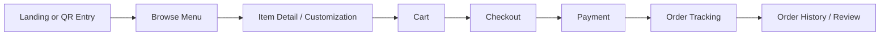

### 33.2 Table Reservation Flow

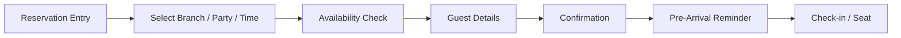

### 33.3 QR Ordering Flow

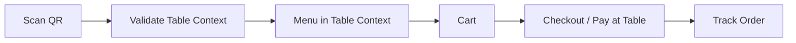

### 33.4 Online Payment Flow

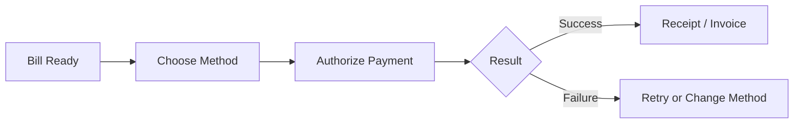

### 33.5 Kitchen Processing Flow

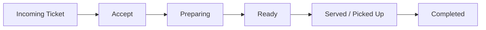

### 33.6 Waiter Order Management Flow

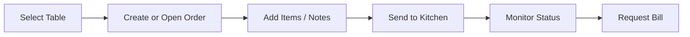

### 33.7 Inventory Purchase Flow

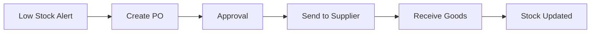

### 33.8 Inventory Deduction Flow

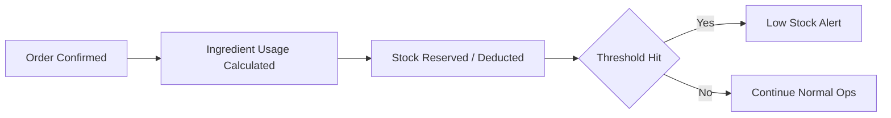

### 33.9 Admin Management Flow

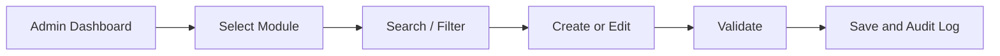

### 33.10 Employee Management Flow

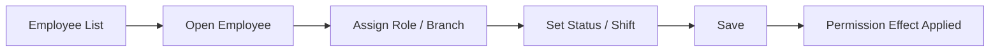

### 33.11 Reports Flow

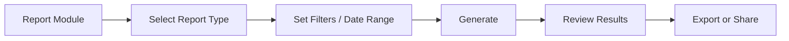

## 34. UX Acceptance Criteria

| Area | Acceptance Criteria |
| --- | --- |
| Global navigation | Users can reach any authorized top-level destination in two interactions or fewer from their shell. |
| Dashboard readability | Primary KPIs and alerts are understandable within 5 seconds of landing on the page. |
| Forms | Required field errors are visible, specific, and announced accessibly without losing entered data. |
| Tables | Search, filter, sort, and row actions remain usable on tablet and desktop. |
| Mobile customer checkout | A customer can move from cart to payment confirmation on mobile without horizontal scrolling. |
| Kitchen queue | A chef can identify the next highest-priority ticket instantly without opening detail first. |
| Waiter ordering | A waiter can add an item to a dine-in order in three steps or fewer after selecting a table. |
| Cashier payment | Failed payments preserve bill state and provide a clear retry path without duplicate charge confusion. |
| Status consistency | The same status always uses the same label, color family, and meaning across modules. |
| Accessibility | All critical paths are keyboard-operable and meet target contrast ratios. |
| Dark mode | All major pages remain readable and functional without contrast regressions. |
| Error states | Every high-impact workflow has an actionable failure state rather than a generic dead end. |

## 35. UI/UX Rules for Codex

Future frontend implementation must follow these non-negotiable rules:

1. Use the approved design tokens for color, typography, spacing, radius, shadow, motion, and breakpoints.
2. Reuse shared components before introducing new patterns.
3. Preserve role-specific shells and navigation logic.
4. Maintain loading, empty, error, success, and disabled states for every major interaction.
5. Avoid arbitrary values where a token or established pattern exists.
6. Keep customer flows welcoming and simplified; keep staff flows dense but readable.
7. Do not introduce new status colors or badge meanings without updating this document.
8. Do not create inaccessible hidden interactions, hover-only critical information, or unlabeled icon buttons.
9. Respect responsive behavior as a first-class requirement, not a late polish step.
10. Any deviation from this blueprint requires documented justification and review.

## 36. Contract Governance

| Governance Rule | Standard |
| --- | --- |
| Design change control | Material UI/UX changes require document update before implementation. |
| Token governance | New tokens require naming review and semantic justification. |
| Component growth | Shared component additions must document states, role impact, and accessibility. |
| Experience consistency review | New major modules must map to existing shell, status, table, form, and feedback patterns. |
| QA alignment | UX QA must validate this document alongside functional acceptance criteria. |

